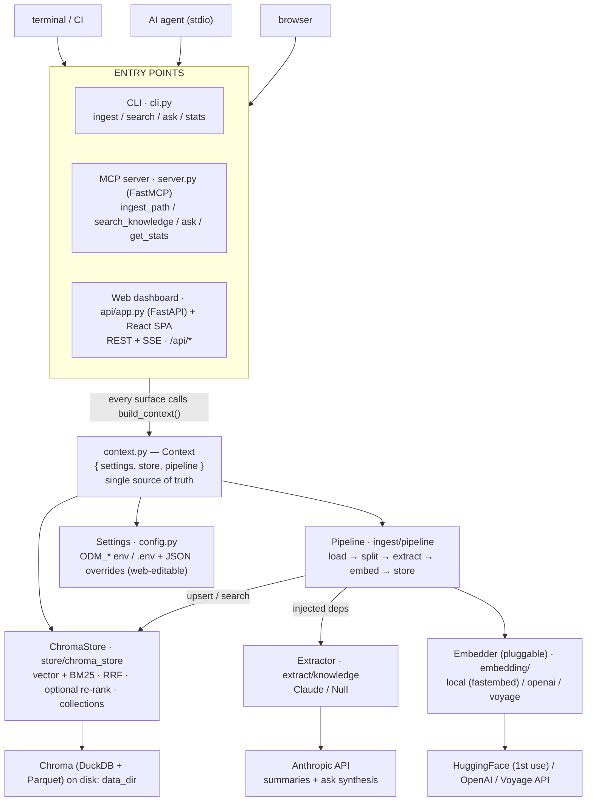
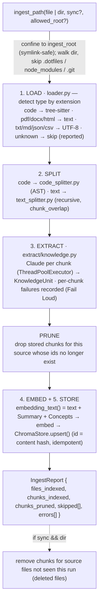
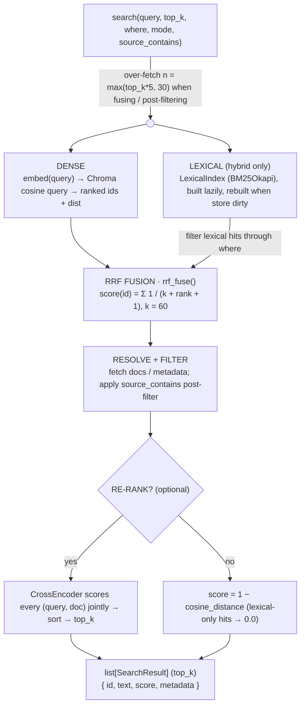
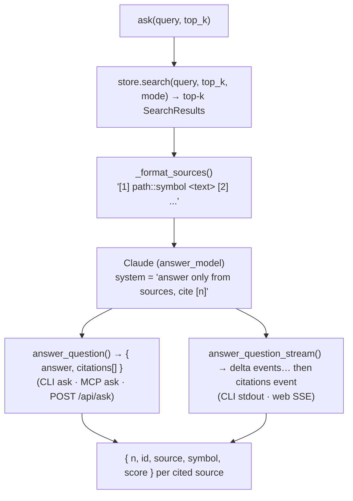
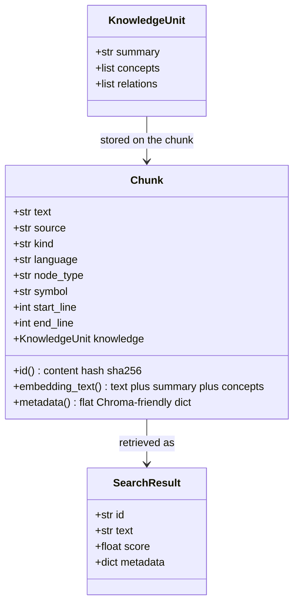
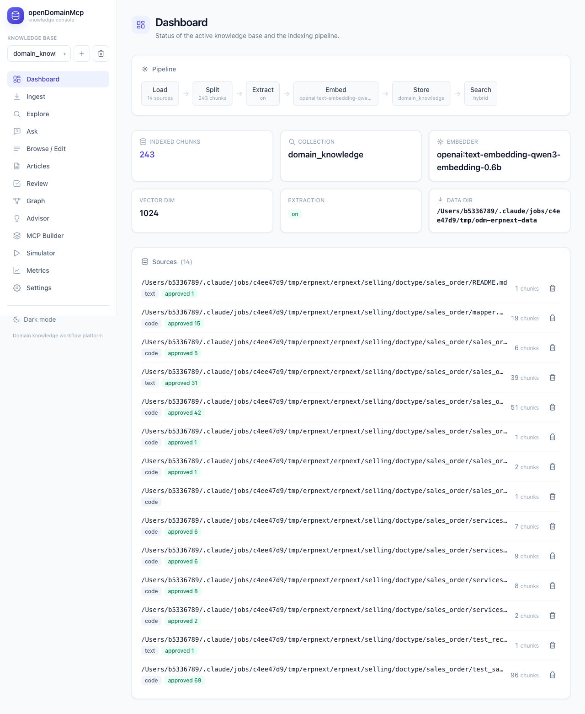
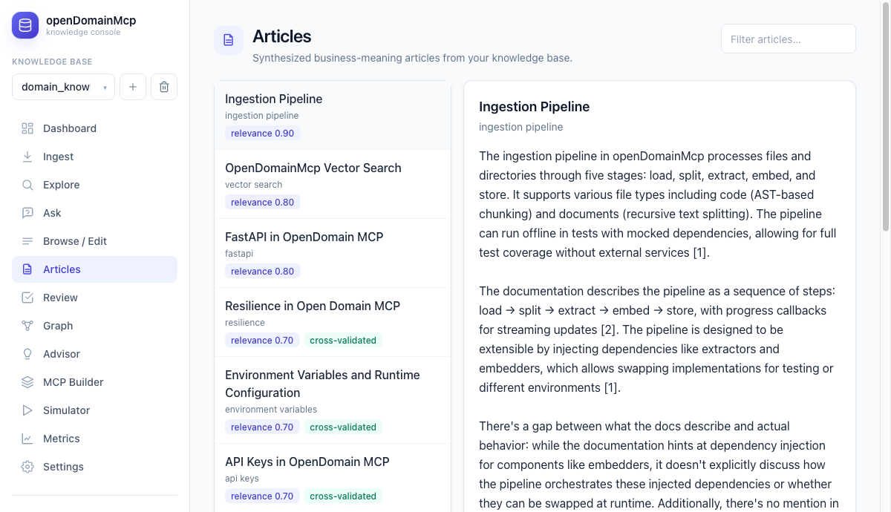

# openDomainMcp

> A general-purpose **domain-knowledge workflow platform**. Drop in documents *or*
> source code of almost any type — the system splits it intelligently, uses Claude
> to extract reusable domain knowledge, embeds it, and stores it in a vector
> database you can query from a **CLI**, an **MCP server**, or a **web dashboard**.

Code is chunked with **AST analysis** (tree-sitter) at function/class/method
boundaries — borrowing the core idea from the open-source `claude-context`
project — while documents are split with a recursive text splitter. Every chunk
is enriched with an LLM-generated summary and concept list *before* embedding, so
retrieval matches on **meaning**, not just surface tokens.

All three surfaces (CLI, MCP, Web) run on the **same** pipeline and store, wired
through a single `build_context()` — there is exactly one source of truth for
ingestion and retrieval.

---

## Table of contents

- [Why this exists](#why-this-exists)
- [Key features](#key-features)
- [System architecture](#system-architecture)
- [The ingestion pipeline](#the-ingestion-pipeline)
- [The retrieval path (hybrid search)](#the-retrieval-path-hybrid-search)
- [The "ask" path (RAG with citations)](#the-ask-path-rag-with-citations)
- [Module map](#module-map)
- [Data model](#data-model)
- [Project layout](#project-layout)
- [Installation](#installation)
- [Quickstart — ingest ERPNext](#quickstart--ingest-erpnext)
- [Usage](#usage)
  - [CLI](#cli)
  - [MCP server](#mcp-server)
  - [Web dashboard](#web-dashboard)
- [HTTP API reference](#http-api-reference)
- [Configuration](#configuration)
- [Supported inputs](#supported-inputs)
- [Security model](#security-model)
- [Extensibility](#extensibility)
- [Testing](#testing)
- [Design principles](#design-principles)

---

## Why this exists

Most "chat with your codebase / docs" tools couple a single UI to a single
storage backend and a single chunking strategy. openDomainMcp instead treats
**ingestion → enrichment → retrieval** as one reusable core and exposes it through
three interchangeable front ends:

| You want to… | Use the… |
| --- | --- |
| Script ingestion / search in a terminal or CI | **CLI** (`opendomainmcp`) |
| Give an AI agent retrieval tools over your knowledge base | **MCP server** (`opendomainmcp-server`) |
| Browse, ingest with live progress, edit, and ask in a browser | **Web dashboard** (`opendomainmcp-web`) |

Because they share one `Context`, anything ingested from the CLI is instantly
searchable from the MCP server and the web UI, and vice versa.

---

## Key features

- **AST-aware code chunking** for 11 languages via bundled tree-sitter grammars,
  with graceful fallbacks for everything else.
- **LLM knowledge extraction** — Claude produces a `summary / concepts / relations`
  structure per chunk; this is stored as metadata *and* folded into the embedding
  text to lift retrieval quality.
- **Hybrid retrieval** — dense vectors + BM25 lexical search fused with
  Reciprocal Rank Fusion (RRF), so exact symbol/identifier matches aren't lost.
- **Optional cross-encoder re-ranking** for a unified relevance score across dense
  and lexical hits.
- **Cited Q&A (`ask`)** — retrieval-augmented answers that cite their sources
  inline as `[n]`, streamed token-by-token over SSE.
- **Multiple knowledge bases** — first-class Chroma collections you can create,
  switch between, and drop.
- **Incremental sync** — re-ingesting prunes stale chunks; directory sync prunes
  deleted files.
- **Pluggable embedders** — local `fastembed` (CPU, no GPU/torch) by default;
  OpenAI or Voyage as drop-in cloud backends.
- **Runtime-editable settings** persisted to disk and editable from the web UI.
- **Security rails** — confine ingestion to an allowed root (symlink-safe) and
  cap upload size.
- **Resilience** — per-request timeouts and bounded exponential-backoff retries on
  external API and store calls.
- **Fully offline tests** — deterministic fake embedder + mocked extractor; no
  network, no model download.

---

## System architecture

The three surfaces are thin adapters. They all call `build_context()`, which
assembles the embedder, extractor, vector store, and pipeline from `Settings`.



**Reading the diagram:** dependencies are *injected* into the pipeline and store
(extractor, embedder, reranker), which is why the entire stack can run offline in
tests by swapping in fakes.

---

## The ingestion pipeline

`Pipeline.ingest_path()` walks a file or directory and runs each file through five
stages. A `progress` callback emits a dict per stage so the CLI and web UI can
stream live status.



**Why enrich before embedding?** `embedding_text()` appends the LLM summary and
concepts to the raw chunk text. A query like *"how does retry/backoff work"* then
matches a function whose code never contains those words but whose extracted
summary does.

**Idempotency:** a chunk's `id` is `sha256(source:start-end + text)`. Re-ingesting
unchanged content upserts the same ids — a no-op. Changed content yields new ids;
the stale ones are pruned in the PRUNE step.

---

## The retrieval path (hybrid search)

`ChromaStore.search()` is the heart of retrieval. In `hybrid` mode it runs dense
and lexical retrieval independently, fuses them with RRF, applies filters, and
(optionally) re-ranks.



- **`mode="vector"`** skips the lexical/fusion branch entirely (pure dense).
- **Filters** (`kind`, `language`, `symbol`) become a Chroma `where` clause;
  `source` is a substring post-filter.
- **Re-ranking** is off by default (downloads a model on first use). When on, it
  gives lexical-only hits a real score instead of `0.0`.

---

## The "ask" path (RAG with citations)

`ask` layers answer synthesis on top of retrieval. The LLM is instructed to answer
*strictly* from the numbered sources and cite them inline as `[n]`.



If no chunk matches, it returns *"No indexed content matched this question."*
Without an `ANTHROPIC_API_KEY` it **fails loudly** with a clear message rather than
fabricating an answer.

---

## Module map

| Area | Module | Responsibility |
| --- | --- | --- |
| Runtime wiring | `context.py` | `build_context()` → assembles `{ settings, store, pipeline }` |
| Configuration | `config.py` | `ODM_`-prefixed settings, `.env`, JSON runtime overrides |
| Data structures | `models.py` | `Chunk`, `KnowledgeUnit`, `SearchResult` (plain dataclasses) |
| File loading & type detection | `ingest/loader.py` | route by extension; extract text from pdf/docx/html |
| AST code chunking | `ingest/code_splitter.py` | tree-sitter chunking at semantic boundaries |
| Recursive text chunking | `ingest/text_splitter.py` | separator-based recursive splitter with overlap |
| Orchestration | `ingest/pipeline.py` | load→split→extract→embed→store, prune, sync, progress |
| Knowledge extraction | `extract/knowledge.py` | `ClaudeExtractor` / `NullExtractor` → `KnowledgeUnit` |
| Embeddings (pluggable) | `embedding/` | `local` (fastembed), `openai`, `voyage` behind `Embedder` |
| Vector store | `store/chroma_store.py` | upsert/search/items/collections over Chroma |
| Lexical + fusion | `retrieval/lexical.py` | BM25 index + `rrf_fuse()` |
| Re-ranking | `retrieval/rerank.py` | optional cross-encoder |
| RAG | `query/rag.py` | cited answer synthesis (sync + streaming) |
| CLI | `cli.py` | `ingest / search / ask / stats / clear / collections` |
| MCP server | `server.py` | FastMCP tools over stdio |
| Web API | `api/app.py` | FastAPI REST + SSE; serves the built SPA |
| Web UI | `web/` | React + Vite + Tailwind dashboard |

---

## Data model

The pipeline passes plain dataclasses (`models.py`) between stages — no business
logic on them, so stages stay decoupled.



---

## Project layout

```
openDomainMcp/
├── src/opendomainmcp/
│   ├── context.py            # build_context(): the single wiring point
│   ├── config.py             # Settings (env + .env + JSON overrides)
│   ├── models.py             # Chunk / KnowledgeUnit / SearchResult
│   ├── cli.py                # CLI entry point  → `opendomainmcp`
│   ├── server.py             # MCP entry point  → `opendomainmcp-server`
│   ├── ingest/
│   │   ├── loader.py         #   type detection + document text extraction
│   │   ├── code_splitter.py  #   tree-sitter AST chunking
│   │   ├── text_splitter.py  #   recursive text chunking
│   │   └── pipeline.py       #   orchestration + sync + security + progress
│   ├── extract/knowledge.py  # Claude / Null knowledge extractor
│   ├── embedding/            # base + local (fastembed) + cloud (openai/voyage)
│   ├── store/chroma_store.py # Chroma vector store + collections admin
│   ├── retrieval/            # lexical (BM25 + RRF) + rerank (cross-encoder)
│   ├── query/rag.py          # cited answer synthesis (sync + stream)
│   └── api/
│       ├── app.py            # FastAPI app  → `opendomainmcp-web`
│       └── static/           # built SPA (created by `npm run build`)
├── web/                      # React + Vite + Tailwind source
│   └── src/pages/            # Dashboard / Ingest / Explore / Ask / Browse / Settings
├── tests/                    # 75 offline tests across 19 files
├── docs/                     # static guide / reference / screenshots
├── pyproject.toml            # deps + console-script entry points
└── .env.example              # all ODM_ settings documented
```

---

## Installation

**Backend (Python ≥ 3.11):**

```bash
python -m venv .venv && source .venv/bin/activate
pip install -e ".[dev]"
cp .env.example .env          # adjust as needed
```

The local embedder downloads a small model (`BAAI/bge-small-en-v1.5`, 384-dim)
from HuggingFace on first use — no GPU or torch required. Knowledge extraction and
`ask` use the Anthropic API (`ANTHROPIC_API_KEY` / `ANTHROPIC_BASE_URL`); set
`ODM_EXTRACT_KNOWLEDGE=false` to ingest without it.

### Free local-first setup (local ingest + cloud `ask`)

You can run the whole platform at near-zero cost by keeping **ingest fully local**
and sending only the occasional `ask` to a free cloud LLM. Because the Anthropic
SDK honours `ANTHROPIC_BASE_URL`, any **Anthropic-compatible** endpoint works with
no code change — e.g. [OpenRouter](https://openrouter.ai)'s `/v1/messages`.

In `.env`:

```bash
# Ingest stays local: embeddings only, no API calls, unlimited & offline.
ODM_EXTRACT_KNOWLEDGE=false
ODM_EMBEDDER_BACKEND=local

# `ask` runs on the cloud via an Anthropic-compatible endpoint (OpenRouter shown).
ODM_ANSWER_MODEL=openai/gpt-oss-120b:free
ANTHROPIC_BASE_URL=https://openrouter.ai/api
ANTHROPIC_API_KEY=sk-or-...        # sent as the x-api-key header
```

| Operation | Runs on | Cost |
| --- | --- | --- |
| Ingest (chunk + embed) | local (fastembed) | free, unlimited, offline |
| Search / Explore (hybrid) | local | free, unlimited, offline |
| Ask (cited Q&A) | cloud LLM | free tier (OpenRouter ≈ 50 req/day; $10 unlocks 1000/day) |

To also extract a knowledge layer during ingest, set `ODM_EXTRACT_KNOWLEDGE=true`
and `ODM_EXTRACTION_MODEL` to a model id — but note free tiers rate-limit bulk
extraction hard, so keep `ODM_EXTRACT_CONCURRENCY` low or use a paid/higher tier.

**Frontend (optional — only to rebuild the dashboard):**

```bash
cd web
npm install
npm run build      # outputs to src/opendomainmcp/api/static/, served by opendomainmcp-web
# or: npm run dev  # Vite dev server, proxies /api → 127.0.0.1:8000
```

---

## Quickstart — ingest ERPNext

A concrete end-to-end run using **[ERPNext](https://github.com/frappe/erpnext)**,
the open-source ERP — the same knowledge base shown in the
[screenshots](#screenshots) above. Each step targets a dedicated `erpnext`
collection so it stays isolated from your other knowledge bases.

```bash
# 1. Ingest ERPNext straight from GitHub. A Git URL is cloned under
#    <data_dir>/.sources/ and confined as the allowed root, then chunked,
#    enriched, embedded and stored — watch live per-file progress.
opendomainmcp --collection erpnext ingest https://github.com/frappe/erpnext

#    (Or ingest a local checkout; --sync prunes chunks for deleted files.)
opendomainmcp --collection erpnext ingest ./erpnext --sync

# 2. Hybrid search (dense + BM25, RRF-fused) across the knowledge base.
opendomainmcp --collection erpnext search "how is a sales order validated" --top-k 5

# 3. Ask a cited question — the answer is synthesised strictly from the
#    retrieved chunks, with inline [n] citations (needs an API key).
opendomainmcp --collection erpnext ask "what happens when a sales order is submitted?"

# 4. Inspect what landed in the collection.
opendomainmcp --collection erpnext stats
```

The same `erpnext` collection is browsable in the web dashboard
(`opendomainmcp-web`) — pick it from the collection switcher to explore, ask, and
edit chunks in the browser.

---

## Usage

### CLI

```bash
opendomainmcp ingest ./path/to/code-or-docs          # add --sync to prune deleted files
opendomainmcp search "how is retrieval implemented" --top-k 5 --language python
opendomainmcp ask "how does hybrid search work"      # cited answer (needs API key), streamed
opendomainmcp collections                            # list knowledge bases
opendomainmcp --collection my_project ingest ./src   # target a specific knowledge base
opendomainmcp stats
opendomainmcp clear
```

Search is **hybrid** by default and supports `--kind`, `--language`, `--symbol`,
and `--source` filters. Set `ODM_SEARCH_MODE=vector` for dense-only.

### MCP server

```bash
opendomainmcp-server     # stdio transport
```

Exposes five tools, each accepting an optional `collection`:

| Tool | Purpose |
| --- | --- |
| `ingest_path(path, sync?, collection?)` | Ingest a file/dir; returns indexed/pruned counts |
| `search_knowledge(query, top_k?, kind?, language?, symbol?, collection?)` | Hybrid search |
| `ask(query, top_k?, collection?)` | Cited answer (`{error: ...}` if no API key) |
| `get_stats(collection?)` | Count, embedder, dimension |
| `list_collections()` | All knowledge bases with chunk counts |

Point any MCP client (e.g. an agent runtime) at the `opendomainmcp-server`
command over stdio to give it retrieval tools across your knowledge base.

### Web dashboard

```bash
opendomainmcp-web        # http://127.0.0.1:8000  (ODM_WEB_HOST / ODM_WEB_PORT to override)
```

A six-page console (React SPA served by FastAPI):

| Page | What it does |
| --- | --- |
| **Dashboard** | Collection status: chunk count, embedder, dimension, data dir |
| **Ingest** | Upload files or ingest a path with **live SSE progress** + optional sync |
| **Explore** | Hybrid search with `kind` / `language` / `source` filters |
| **Ask** | Cited Q&A, **streamed token-by-token** with clickable sources |
| **Browse / Edit** | Page through stored chunks; edit metadata; delete items |
| **Settings** | View/edit runtime settings (persisted to `settings.json`) |

#### Screenshots

The **Dashboard** shows live collection status — chunk count, embedder, dimension,
data dir, and the ingested sources (here a real ERPNext knowledge base of 243 docs):



The **Articles** page surfaces synthesized, business-meaning articles distilled from
the knowledge base:



More views — Ingest with live progress, Explore, Ask, and Browse / Edit:

| Ingest | Explore |
| --- | --- |
|  |  |
| **Ask** | **Browse / Edit** |
|  |  |

A **knowledge-base switcher** in the sidebar lets you create, switch, and target
collections; the choice is remembered in `localStorage` and sent via the
`X-Collection` header / `collection` query param. Dark mode included.

---

## HTTP API reference

The web UI is a thin client over these endpoints (`api/app.py`). All accept an
optional `?collection=` query param or `X-Collection` header.

| Method & path | Purpose |
| --- | --- |
| `GET  /api/health` | Liveness probe |
| `GET  /api/stats` | Count, embedder, dim, data dir, extraction flag |
| `POST /api/search` | Hybrid search `{ query, top_k, kind?, language?, symbol?, source_contains? }` |
| `POST /api/ask` | Cited answer (blocking) |
| `GET  /api/ask/stream` | Cited answer streamed as SSE (`delta`… then `citations`) |
| `POST /api/upload` | Multipart upload → staged on disk (size-capped, streamed) |
| `GET  /api/ingest/stream` | Ingest a path, streaming per-stage progress as SSE |
| `GET  /api/items` | Page stored chunks (`limit`, `offset`, `kind?`) |
| `GET/PATCH/DELETE /api/items/{id}` | Read / update metadata / delete a chunk |
| `GET/PATCH /api/settings` | Read or update runtime-editable settings |
| `GET/POST /api/collections`, `DELETE /api/collections/{name}` | Manage knowledge bases |

Both streaming endpoints bridge the blocking model/pipeline calls onto the event
loop via a queue + `asyncio.to_thread`, and surface failures as `error` events
(Fail Loud) rather than hanging.

---

## Configuration

All settings use the `ODM_` prefix and can be set via environment or `.env`
(`config.py`). A subset is **editable at runtime** from the web UI and persisted to
`<data_dir>/settings.json` (overrides layered on top of env at load time).

| Setting | Default | Editable in UI | Description |
| --- | --- | :---: | --- |
| `ODM_DATA_DIR` | `.opendomain` | | Where Chroma + `settings.json` + uploads live |
| `ODM_COLLECTION_NAME` | `domain_knowledge` | | Default knowledge base |
| `ODM_INGEST_ROOT` | *(unset)* | | Confine ingestion to this tree (symlink-safe) |
| `ODM_MAX_UPLOAD_MB` | `50` | | Reject larger web uploads |
| `ODM_EMBEDDER_BACKEND` | `local` | ✅ | `local` \| `openai` \| `voyage` |
| `ODM_EMBEDDER_MODEL` | `BAAI/bge-small-en-v1.5` | ✅ | Embedding model |
| `ODM_EXTRACT_KNOWLEDGE` | `true` | ✅ | Enable Claude knowledge extraction |
| `ODM_EXTRACTION_MODEL` | `claude-sonnet-4-6` | ✅ | Extraction model |
| `ODM_EXTRACT_CONCURRENCY` | `8` | ✅ | Parallel extraction calls per file |
| `ODM_CHUNK_SIZE` | `1200` | ✅ | Target text chunk size (chars) |
| `ODM_CHUNK_OVERLAP` | `150` | ✅ | Overlap carried between text chunks |
| `ODM_CODE_MAX_CHUNK_CHARS` | `2000` | ✅ | AST chunk size ceiling before recursing |
| `ODM_SEARCH_MODE` | `hybrid` | ✅ | `hybrid` (dense+BM25) \| `vector` |
| `ODM_RERANK_ENABLED` | `false` | ✅ | Cross-encoder re-ranking after fusion |
| `ODM_RERANK_MODEL` | `Xenova/ms-marco-MiniLM-L-6-v2` | | Re-ranker model |
| `ODM_ANSWER_MODEL` | `claude-sonnet-4-6` | ✅ | RAG answer model |
| `ODM_REQUEST_TIMEOUT` | `60` | | Per-request timeout (s) for external calls |
| `ODM_MAX_RETRIES` | `2` | | Retries on transient API/store errors |

**Credentials** are read from the standard provider env vars — the Anthropic SDK
reads `ANTHROPIC_API_KEY` / `ANTHROPIC_BASE_URL`; cloud embedders need
`OPENAI_API_KEY` / `VOYAGE_API_KEY`. Credentials and `data_dir` are deliberately
**not** runtime-editable.

---

## Supported inputs

**Code (AST chunking via tree-sitter):** Python, JavaScript (+JSX), TypeScript,
TSX, Java, Go, Rust, C, C++, C#, Ruby, Bash. Other code-like extensions
(PHP, Swift, Kotlin, Scala, Lua) are recognised and fall back to **line-window**
chunking when no grammar is bundled.

**Documents:** `txt`, `md`/`markdown`, `rst`, `pdf`, `docx`, `html`/`htm`, `json`,
`yaml`/`yml`, `csv`/`tsv`, `xml`, `toml`, `ini`, `cfg`, `css`, `log`, and **any
file that decodes as UTF-8 text**. Binary / non-UTF-8 files are skipped and
reported (never silently dropped).

---

## Security model

When exposing the web or MCP server beyond a trusted machine:

- **`ODM_INGEST_ROOT`** confines ingestion to a directory tree. Paths are
  `resolve()`d (following symlinks) and rejected if they escape the root — so a
  symlink pointing outside the root is caught, both for the requested path and for
  every file discovered during a directory walk.
- **`ODM_MAX_UPLOAD_MB`** caps uploads. Files are streamed to disk in 1 MB chunks
  and aborted with `413` the moment they exceed the limit, so a huge upload never
  lands in memory.
- **Noise/secrets filter:** the walker skips dotfiles and common heavy/private
  directories (`.git`, `node_modules`, `.venv`, `dist`, `build`, …).

---

## Extensibility

The injection seams make extension localized:

- **New embedder** → implement `Embedder` (`embed` + `dim`), register it in
  `embedding/__init__.py:get_embedder()`.
- **New language** → add the extension→language mapping in `loader.py` and the
  grammar entry in `code_splitter.py:_GRAMMARS` (plus the wheel in `pyproject.toml`).
- **New extractor** (e.g. a different provider or a heuristic one) → implement
  `extract(text, kind, language) -> KnowledgeUnit`, return it from `get_extractor()`.
- **New surface** → call `build_context()` and drive `ctx.pipeline` / `ctx.store`;
  you inherit ingestion, hybrid search, and RAG for free.

---

## Testing

```bash
pytest
```

**75 tests across 19 files**, all fully offline: a deterministic **FakeEmbedder**
(hashed bag-of-words so token overlap drives cosine similarity) and a
**FakeExtractor** stand in for the network, and Chroma runs via an in-memory
`EphemeralClient`. Coverage spans the splitters, loader, pipeline (incl. sync and
security), store (incl. hybrid search), retrieval, re-ranking, RAG, config,
resilience/retries, the CLI, the HTTP API, and collections.

---

## Design principles

This codebase follows the conventions in `CLAUDE.md`:

- **Simplicity first** — e.g. the recursive text splitter and BM25 fusion are
  small in-house implementations rather than heavy dependencies.
- **Fail loud** — per-file/per-chunk failures are recorded in the `IngestReport`
  and surfaced; missing API keys and non-UTF-8 files raise clear errors instead of
  degrading silently.
- **One source of truth** — every surface flows through `build_context()`, so
  ingestion and retrieval behave identically everywhere.
- **Dependency injection** — store, extractor, embedder, and reranker are injected,
  which is exactly what lets the whole stack run offline under test.

---

## License

MIT.
