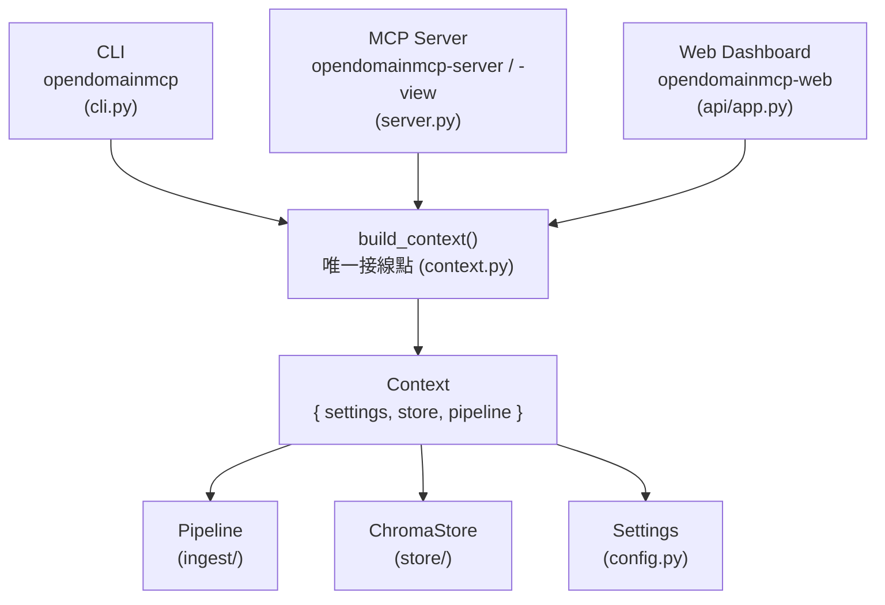
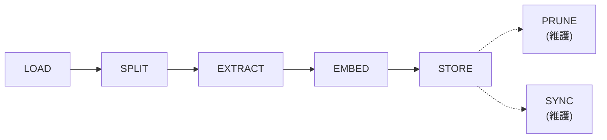
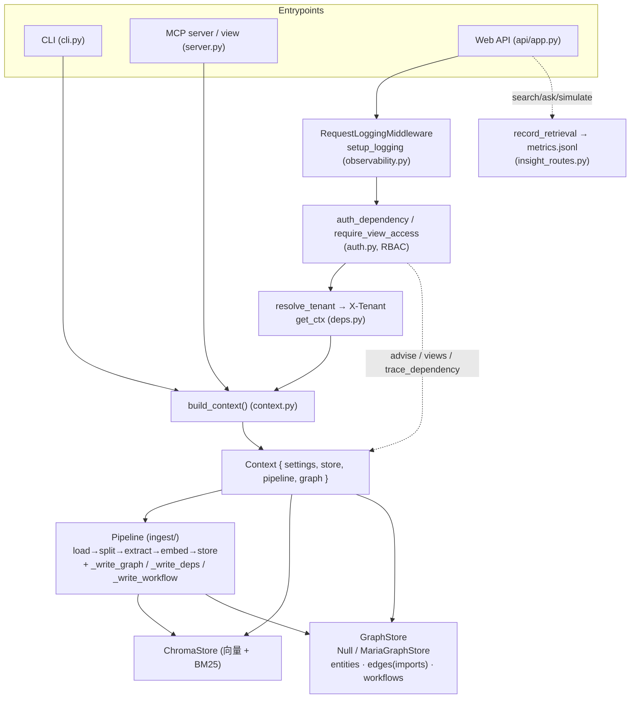

# OpenDomainMCP — 技術架構文件

> 本文件描述系統的實際實作架構（截至 Phase 2 合併後）。所有路徑相對於 repo 根目錄。產品需求見 [PRD.md](./PRD.md)，任務進度見 [TASKS.md](./TASKS.md)。

---

## 1. 系統總覽

OpenDomainMCP 採「單一真實來源（single wiring point）+ 三個可互換入口」設計：



- **三個入口都透過 `build_context()`** 取得相同的 `settings / store / pipeline`，確保行為一致。
- 相依元件（store、extractor、embedder、reranker）皆以工廠函式注入，測試可用 fake 全離線執行。

---

## 2. 三層架構（對應 PRD）

| Layer | 內容 | 實作 |
|-------|------|------|
| **Layer 1 — Ingestion** | Sources → Parsing → Chunking → Extraction → Embedding | `ingest/`、`extract/`、`embedding/` |
| **Layer 2 — Knowledge Store** | Vector + Structured Domain + Metadata | `store/chroma_store.py`（Chroma：向量 + 扁平 metadata；BM25 lexical index） |
| **Layer 3 — MCP View Layer** | 同一知識庫產生多個 MCP | `views/__init__.py`、`server.py` |

---

## 3. 擷取流程（Ingestion Pipeline）

5 個主要階段 + 2 個維護階段，由 `ingest/pipeline.py` 的 `Pipeline.ingest_path()` 編排：



| 階段 | 說明 | 模組 |
|------|------|------|
| **LOAD** | 型別偵測與文字擷取（code/text/api） | `ingest/loader.py` → `load_file()` → `LoadedDoc` |
| **SPLIT** | code 走 AST、api 走 OpenAPI、text 走遞迴切分 | `code_splitter.py` / `openapi.py` / `text_splitter.py` |
| **EXTRACT** | LLM 萃取領域知識（已預分類者跳過） | `extract/knowledge.py` |
| **EMBED** | 以 enriched text（chunk + summary + concepts）產生向量 | `embedding/` |
| **STORE** | Chroma upsert（依 content hash 冪等） | `store/chroma_store.py` |
| **PRUNE** | 檔案編輯後移除過期 chunk | `pipeline._ingest_file()` |
| **SYNC** | `sync=True` 時移除已刪除檔案的 chunk | `pipeline._sync_deletions()` |

### 來源解析（Phase 2 M4）

`Pipeline.ingest_path()` 先呼叫 `ingest/sources.py` 的 `prepared_source(spec, data_dir)`（context manager）：

- **Git**（`is_git_spec`：`git@` / `git+` / `ssh://` / `.git` / github|gitlab|bitbucket）→ `git clone --depth 1` 到 `data_dir/.sources/<uuid>/`，結束後清理。
- **Zip**（`is_zip_spec`：本機 `.zip` 檔）→ 安全解壓（zip-slip 防護：解析每個成員目標，拒絕 `..` 與絕對路徑逃逸）到暫存目錄。
- **一般路徑** → 直接沿用，`allowed_root` 機制限制擷取範圍。

### LOAD 型別路由（`load_file`）

| 副檔名 | kind | 處理 |
|--------|------|------|
| `LANGUAGE_BY_EXT`（.py/.js/.ts/.go/.rs/.java/.c/.cpp/.cs/.rb/.php/.swift/.kt/.scala/.sh/.lua…） | `code` | tree-sitter（11 種具 AST wheel；無 wheel 者如 php/swift/kt/scala/lua 退回 line 切分） |
| `.pdf` / `.docx` | `text` | pypdf / python-docx |
| `.html` / `.htm` | `text` | HTMLParser（去除 script/style） |
| `.json` / `.yaml` / `.yml` 且 `looks_like_openapi()` | `api` | OpenAPI 解析，language="openapi"（非 OpenAPI 的 JSON/YAML 退回 text） |
| `.graphql` / `.graphqls` / `.gql`（`_GRAPHQL_EXTENSIONS`） | `api`（LoadedDoc）→ split 後 chunk `kind="text"` | GraphQL SDL，language="graphql"，每個 top-level 定義一個 chunk（見 §3 GraphQL） |
| `.xml` 且 `looks_like_mediawiki()` | `text` | MediaWiki 匯出展平成 per-page 區段，language="mediawiki"（見 §3 Wiki）；非 MediaWiki 的 XML 退回 text |
| 其他 TEXT_EXTENSIONS（.md/.txt/.rst/.csv/.tsv/.log/.ini/.toml/.cfg/.xml/.css…） | `text` | 原樣讀取 |
| 未知副檔名 | `text`（若可 UTF-8 解碼） | 否則 `UnsupportedFileError`（fail loud） |

### OpenAPI/Swagger 解析（`ingest/openapi.py`）

- `parse_spec(text)`：先試 JSON 再試 YAML（`yaml.safe_load`）。
- `looks_like_openapi(data)`：含 `openapi`/`swagger` 鍵且有 `paths` dict。
- `split_openapi(text, source)`：**每個 HTTP operation 一個 Chunk**：
  - `text` = method + path + summary + description + 參數 + 回應碼（`_operation_text()`）
  - `symbol` = `operationId` 或 `"METHOD path"`
  - 預先分類 `KnowledgeUnit`：`knowledge_type="API"`、`audience=["engineering"]`、`confidence=1.0`
- 預分類 chunk 在 `pipeline._extract_one()` 會**跳過 LLM 擷取**（節省成本）。

### GraphQL SDL 解析（`ingest/graphql.py`）

- `loader.load_file()` 對 `.graphql/.graphqls/.gql` 回傳 `LoadedDoc(kind="api", language="graphql")`；`pipeline._ingest_file()` 偵測 `doc.language == "graphql"` 後改走 `split_graphql()`。
- `split_graphql(text, source)`：先 `_strip_comments` 去註解，再 `_split_top_level` 切出每個頂層定義。
  - **Root 型別**（`Query`／`Mutation`／`Subscription`，`_ROOT_TYPES`）：**每個 field 一個 chunk**，`symbol = "RootType.field"`。
  - 其他 `type/interface/enum/scalar/...` 定義：**整個定義一個 chunk**，`symbol = 名稱`。
  - 每個 chunk 皆預先分類為 `knowledge_type="API"`、`audience=["engineering"]`、`confidence=1.0`（`_knowledge()`），同樣**跳過 LLM 擷取**。
  - 注意：`split_graphql` 產生的 `Chunk.kind` 為 `"text"`（並非 `"api"`），但 `language` 維持 `"graphql"`、`knowledge_type` 為 `"API"`。Developer view 的 `get_api_implementation`（`knowledge_type=API`）可命中；`search_code`（`kind=code`）不會。

### Wiki 匯出解析（`ingest/wiki.py`）

Wiki 匯出檔會把多頁包進單一檔案，逐字元切窗會混到不相干頁面。處理方式是**先展平成乾淨文字**，每頁渲染成 `= Title =` 區段，再交給一般 embed/store 流程：

- **偵測**：`looks_like_mediawiki(text)` 檢查根標籤 `<mediawiki>` 與是否有 `<page>` 子節點（regex 快篩，不需先完整解析）。
- **展平**：`mediawiki_to_text(text)` 以 stdlib `xml.etree.ElementTree` 解析：
  - 逐 `<page>` 取**最後一個 `<revision>` 的 `<text>`** 作為內文（`_latest_revision_text`），標題取 `<title>`。
  - **跳過** redirect 頁（含 `<redirect>`）與標題或內文為空者。
  - 每頁輸出 `= {title} =\n{body}`，多頁以空行串接。
  - 以 `_local_name()` 去除 namespace 前綴，相容有/無命名空間的匯出。
- **Fail Loud**：XML 損毀或根元素非 `<mediawiki>` 一律拋 `ValueError`，不靜默回空字串。
- 另有 `looks_like_confluence_html(text)`（偵測 Confluence `<meta>` 或 `id="main-content"`）作為 best-effort heuristic；目前 loader 僅接線 MediaWiki XML 分支，Confluence heuristic 尚未在 `load_file` 啟用。

---

## 4. 知識萃取（Knowledge Extraction）

`extract/knowledge.py`：

- **`_SYSTEM` prompt**：要求模型只回傳一個 JSON 物件，鍵包含
  `summary`、`concepts`、`relations`、`knowledge_type`（限定 `KNOWLEDGE_TYPES`）、
  `audience`（限定 `AUDIENCES`）、`confidence`(0–1)、`tags`、`permissions`、`references`。
  （`version`、`review_status` **不**由 LLM 萃取。）
- **`_parse(raw)`** 防禦性正規化：
  - `confidence` clamp 到 [0,1]
  - `knowledge_type` 以 `_norm_choice` 對 `KNOWLEDGE_TYPES` 做大小寫不敏感比對，不符回 `""`
  - `audience` 逐項白名單過濾
  - list 欄位以 `_str_list` 去空白
- **`ClaudeExtractor`**：呼叫 Anthropic（`extraction_model`，預設 `claude-sonnet-4-6`），帶 timeout/retries。
- **`NullExtractor`**：`extract_knowledge=False` 時回傳空 `KnowledgeUnit`。
- **`get_extractor(settings)`** 工廠選擇上述兩者。

### Review 狀態（Phase 2 M3）

`pipeline._extract_one()`：

- 若 `settings.review_mode == True`：新擷取 chunk 設 `review_status="pending"`。
- 否則沿用 `KnowledgeUnit` 預設 `review_status="approved"`（向後相容，舊資料無此欄位視為可見）。

---

## 5. 資料模型（`models.py`）

```python
KNOWLEDGE_TYPES = ("Feature","Workflow","API","Permission","Constraint","Error",
                   "Troubleshooting","Architecture","Code","Glossary","Runbook","FAQ")
AUDIENCES = ("product_manager","solutions_architect","operations","engineering","support")
```

### `KnowledgeUnit`（領域知識）

| 欄位 | 型別 | 預設 |
|------|------|------|
| `summary` | str | `""` |
| `concepts` | list[str] | `[]` |
| `relations` | list[str] | `[]` |
| `knowledge_type` | str | `""` |
| `audience` | list[str] | `[]` |
| `confidence` | float | `0.0` |
| `version` | str | `""` |
| `permissions` | list[str] | `[]` |
| `tags` | list[str] | `[]` |
| `references` | list[str] | `[]` |
| `review_status` | str | `"approved"` |

### `Chunk`（待嵌入儲存單位）

`text, source, kind("text"/"code"/"api"), language, node_type, symbol, start_line, end_line, knowledge`

- `content_hash` / `id`：`sha256(source:start-end + text)`，冪等 upsert 用。
- `embedding_text()`：text + `Summary:` + `Concepts:`，讓檢索貼近語意。
- `metadata()`：扁平化成 Chroma 友善 dict（list → `", "` 或 `" | "` join；丟棄 None/空值）。

### `SearchResult`

`id, text, score, metadata`

---

## 6. 知識儲存（`store/chroma_store.py`）

- **向量 + 結構化 + metadata**：皆存於 Chroma（PersistentClient，cosine）。metadata 為扁平 scalar。
- **Lexical index**：記憶體內 BM25（`retrieval/lexical.py`），lazy-build、upsert/delete 後標記 dirty。
- **過濾**：`build_where(filters)` 支援 `_FILTER_FIELDS = ("kind","language","symbol","knowledge_type","review_status")`；單條件回 `{k:v}`，多條件回 `{"$and":[...]}`。
  - `audience` **不在** Chroma 過濾欄位（存成 join 字串），改在 view 層 client-side 後過濾。
- **CRUD / 管理**：`upsert / search / get_items / get_item / update_metadata / delete_item / get_ids_for_source / delete_ids / get_all_sources / list_collections / create_collection / drop_collection / stats / clear`。
- **Resilience**：`_retry()` 對 transient 失敗指數退避重試（`max_retries`）。

---

## 7. 檢索引擎（Retrieval）

`store.search(query, top_k, where, mode, source_contains)`：

1. **Vector**：dense embedding cosine（`mode="vector"`，預設）。
2. **Hybrid**：dense + BM25，以 **RRF** 融合（k=60，over-fetch ×5 再裁切）。
3. **Filters**：`where`（Chroma）+ `source_contains`（後過濾）。
4. **Re-rank**（選用）：`retrieval/rerank.py` cross-encoder（`Xenova/ms-marco-MiniLM-L-6-v2`），給所有候選統一分數。

---

## 8. RAG 問答（`query/rag.py`）

- `answer_question(query, store, settings, top_k)`：檢索 top-k → 組成編號 sources → Claude 合成帶 `[n]` 引用的答案 → 回 `{answer, citations}`。
- `answer_question_stream(...)`：先 yield `delta` token 事件，最後 yield `citations` 事件（SSE）。
- 無檢索結果則短路（不捏造）；缺 `ANTHROPIC_API_KEY` 拋 `AnswerError`（fail loud）。

---

## 9. MCP 層（`server.py` + `views/__init__.py`）

### 通用 server（預設）

`ingest_path`、`search_knowledge`、`ask`、`get_stats`、`list_collections`。

### 角色視圖（Phase 2 M2）

- `ViewTool(name, description, filters, default_top_k=5)`、`ViewSpec(name, title, purpose, tools)`，宣告於 `VIEWS` dict。
- `build_view_server(view_name)`：依 `VIEWS` 動態註冊每個工具，工具實作呼叫 `run_view_tool()`。
- `get_server(view)`：`"generic"/""` 回通用 server，否則回對應視圖。
- `main()`：解析 `--view`（或 `ODM_MCP_VIEW` 環境變數，預設 `generic`）。

### `run_view_tool()` 行為

- 從 filters 取出 `audience` 做 client-side 後過濾（over-fetch ×3）。
- 若 `settings.retrieve_approved_only`：注入 `review_status="approved"`。
- 其餘 filters 經 `build_where()` 套用。

### 工具 → 過濾條件對照

| View | Tool | Filter |
|------|------|--------|
| product | get_feature | knowledge_type=Feature |
| product | get_workflow | knowledge_type=Workflow |
| product | get_constraint | knowledge_type=Constraint |
| product | search_product_knowledge | audience=product_manager |
| operations | get_runbook | knowledge_type=Runbook |
| operations | get_troubleshooting | knowledge_type=Troubleshooting |
| operations | get_incident_response | knowledge_type=Runbook, audience=operations |
| operations | get_rollback_procedure | knowledge_type=Runbook |
| developer | search_code | kind=code |
| developer | get_class | kind=code + node_type ∈ class/struct/enum/interface/trait/type_alias |
| developer | get_function | kind=code + node_type ∈ function/method/constructor |
| developer | trace_dependency | 先查 dependency graph（`imports` 邊），無結果才回退 kind=code |
| developer | get_api_implementation | knowledge_type=API |
| support | get_known_issue | knowledge_type=Error |
| support | get_error_explanation | knowledge_type=Error |
| support | get_resolution_steps | knowledge_type=Troubleshooting |
| support | search_faq | knowledge_type=FAQ |
| architecture | get_component | knowledge_type=Architecture |
| architecture | get_dependency | knowledge_type=Architecture |
| architecture | get_dataflow | knowledge_type=Architecture |
| architecture | search_architecture | audience=solutions_architect |

> 註：`get_class`／`get_function` 在 `kind=code` 之外，會以 `node_type` 後過濾（`ViewTool.node_types`，over-fetch ×3）只回傳對應的宣告節點（見 `views/__init__.py` 的 `_CLASS_NODE_TYPES`／`_FUNCTION_NODE_TYPES`）。`trace_dependency` 已升級為「優先讀取程式碼相依圖」：先以 `_trace_dependency()` 查 `imports` 邊的鄰居，命中即回傳圖鄰居（包成 `{id,text,score,metadata}`），否則回退至 `kind=code` 檢索（見 §16.2）。

---

## 10. Web API（`api/app.py`，FastAPI）

| Method | Path | 說明 |
|--------|------|------|
| GET | `/api/health` | 健康檢查 |
| GET | `/api/stats` | 統計 |
| POST | `/api/search` | 混合搜尋（套用 approved-only 政策） |
| POST | `/api/ask` | RAG 問答 |
| GET | `/api/ask/stream` | RAG SSE 串流 |
| POST | `/api/upload` | 串流上傳（大小上限） |
| GET | `/api/ingest/stream` | 擷取 SSE 串流 |
| GET | `/api/items` | 列出 chunk（`?limit&offset&kind&review_status&knowledge_type`） |
| POST | `/api/items` | **手動新增知識**（`ItemCreate`，自動 approved） |
| GET | `/api/items/{id}` | 取單筆 |
| PATCH | `/api/items/{id}` | 編輯 metadata |
| DELETE | `/api/items/{id}` | 刪除 |
| POST | `/api/items/{id}/approve` | **核准** → review_status=approved |
| POST | `/api/items/{id}/reject` | **拒絕** → review_status=rejected |
| GET | `/api/settings` | 讀設定 |
| PATCH | `/api/settings` | 改設定（`{values}`，限 editable） |
| GET | `/api/views` | **列出 5 個 MCP 視圖與工具** |
| POST | `/api/simulate` | **Agent Simulator**：跑某視圖工具，回 grounding |
| GET/POST/DELETE | `/api/collections[...]` | 知識庫 CRUD |

- Collection 經 `?collection=` 或 `x-collection` header 選擇；SPA 由 `api/static/` 提供。
- `/api/simulate` 回傳 `{view, tools:[{tool, results}], grounding:{hits, avg_score, knowledge_types}}`。

---

## 11. Web 前端（`web/`，React 18 + Vite + Tailwind）

- **路由**（`main.tsx`，hash router）：`/`(Dashboard)、`ingest`、`explore`、`ask`、`browse`、`review`、`mcp`、`simulator`、`settings`。
- **新頁面**（Phase 2 M5）：`Review.tsx`（審核佇列：tabs + 核准/拒絕/編輯 + 手動新增 Modal）、`McpBuilder.tsx`（視圖/政策設定 + 發布指令片段）、`Simulator.tsx`（任務輸入 + grounding 統計）。
- **共用**：`components/ui.tsx`（Button/Card/Modal/Badge/Input/Select/Toast…）、`components/icons.tsx`（新增 IconReview/IconBuilder/IconSimulator）、`api.ts`（新增 `approveItem/rejectItem/addItem/views/simulate` 與型別、`KNOWLEDGE_TYPES`/`AUDIENCES` 常數）。

---

## 12. CLI（`cli.py`）

```
opendomainmcp [--collection NAME] <command>
  ingest PATH [--sync]      # 擷取檔案/目錄/Git/Zip/OpenAPI
  search QUERY [--top-k --kind --language --symbol --source]
  ask QUERY [--top-k]
  stats
  clear
  collections
```

---

## 13. 設定（`config.py`，env 前綴 `ODM_`）

可在 web UI 編輯的欄位 `EDITABLE_FIELDS`：
`embedder_backend, embedder_model, extract_knowledge, extraction_model, chunk_size, chunk_overlap, code_max_chunk_chars, extract_concurrency, search_mode, rerank_enabled, answer_model, review_mode, retrieve_approved_only`

Phase 2 新增設定：
- `review_mode: bool = False` — 新擷取標為 `pending`，需審核。
- `retrieve_approved_only: bool = False` — 檢索僅回 `approved`。

Phase 3/4 新增設定（**env-only，不在 `EDITABLE_FIELDS`、不可由 UI 編輯**）：
- `multi_tenant: bool = False` — 開啟後每個請求須帶 `X-Tenant` header，集合命名空間化為 `<tenant>::<collection>`（見 §21）。
- `auth_enabled: bool = False` + `api_keys: str = ""` — RBAC / API key 認證（見 §19）。
- `graph_db_host/port/user/password/name` — 知識圖 MariaDB 連線（`MariaGraphStore`；未配置時 pipeline 以 `NullGraphStore` 退化，不影響向量流程）。

其餘：storage、security（`ingest_root`、`max_upload_mb`）、embedding、chunking、retrieval、RAG、resilience（`request_timeout`、`max_retries`）。憑證（`ANTHROPIC_API_KEY` 等）僅由 env 讀取，不可由 UI 編輯。

---

## 14. 入口點與相依（`pyproject.toml`）

**Console scripts**：
```
opendomainmcp        → cli:main
opendomainmcp-server → server:main        # 通用 MCP（或 --view）
opendomainmcp-view   → server:main        # 角色視圖 MCP
opendomainmcp-web    → api.app:main       # Web Dashboard
```

**主要相依**：`chromadb`、`fastembed`、`rank-bm25`、`tree-sitter`(+11 語言 wheel)、`pypdf`、`python-docx`、`pyyaml`、`anthropic`、`mcp`、`fastapi`、`uvicorn`、`sse-starlette`、`pydantic-settings`、`python-multipart`。Python `>=3.11`。

---

## 16. 程式碼相依圖（Code Dependency Graph）

Phase 3 在「實體/工作流知識圖」之外，新增以 import 關係為主的**程式碼相依圖**，與既有圖**共用 entities/edges 兩張表**（不另開 schema）。

### 16.1 萃取（`graph/deps.py`）

`extract_dependencies(language, source, symbol, chunk_id) -> (list[Entity], list[Edge])`：純函式，無 I/O、不變動輸入。

- **import 解析**：tree-sitter 可用時讀 import；否則 regex fallback 處理常見形式：
  - Python：`import a, b.c as d`、`from a.b import x`（`_py_imports`）。
  - JS/TS（`javascript/typescript/tsx/jsx`）：`import ... from "x"`、`export ... from 'x'`、裸 `import "x"`、`require("x")`（`_js_imports`）。
  - 其他語言 → 回傳 `([], [])`，呼叫端可無條件 upsert。
- **節點/邊**：
  - 來源模組節點：`type="module"`，display 取 chunk 的 `symbol`（AST splitter 設定），無則退回 `chunk_id`（`_module_label`）。
  - 每個 import 目標 → 一個 `module` 實體 + 一條 `Edge(relation_type="imports")`，皆 `confidence=1.0`。
  - 名稱經 `graph.normalize.normalize_name` 正規化；自我相依（`dst == src`）略過。
  - import 名稱先 order-preserving 去重（`_dedupe`），edges 由 store 端再去重。

### 16.2 pipeline 接線（`ingest/pipeline.py::_write_deps`）

- 於 `_persist()` 內、`_write_graph()` 之後呼叫 `_write_deps(chunks)`。
- 僅處理 `chunk.kind == "code"`；無 import 的 chunk 跳過。
- 對 `self._graph`（預設 `NullGraphStore`，或配置後的 `MariaGraphStore`）`upsert_entities` + `upsert_edges`。Null graph 也能安全執行。

### 16.3 `trace_dependency` 升級（`views/__init__.py`）

`run_view_tool()` 對 `tool.name == "trace_dependency"` 先呼叫 `_trace_dependency(ctx, query, top_k)`：

- 讀 `ctx.graph.neighbors(query, relation_type="imports", depth=1)`。
- 命中時將每個鄰居包成標準 `{id, text, score, metadata}` envelope（`text` 形如 `"<root> imports <name>"` 或 `"... imported by ..."`，依 direction）。
- 圖不可用或查無對應實體 → 回 `[]`，**回退**至原本 `kind=code` 檢索（行為不退化）。

---

## 17. Pre-Execution Advisor（`advisor/__init__.py`）

實作 PRD Phase 4：agent 在動作前詢問「我該先知道什麼」。**純聚合，無 LLM 呼叫**。

`advise(ctx, action, top_k=5) -> dict`：

- 對空白 `action` 拋 `ValueError`（fail loud）。
- 五個檢索 facet，皆走與 `views.run_view_tool` 一致的 `build_where` + `retrieve_approved_only` 政策（`_approved_filters`）：

| Facet | knowledge_type 桶（`_search_types`） |
|-------|------|
| `workflow` | Workflow、Runbook |
| `risks` | Error、Troubleshooting、Constraint |
| `permissions` | Permission |
| `constraints` | Constraint |
| （architecture，併入 dependencies） | Architecture |

- **OR 模擬**：Chroma 等值過濾無法對單欄做 OR，故每個 type 各查一次再合併、依 id 去重、保留最高名次、裁到 `top_k`。
- **dependencies**：合併「圖相依」+「Architecture 檢索」並去重（`_dedupe_dependencies`，圖項以 `name`、檢索項以 `id` 為 key，圖項優先）。
  - 圖相依（`_graph_dependencies`）：以 `action` 與其相關工作流名（`list_workflows(q=action)`）為 seed，沿 `imports`/`depends_on` 鄰居取出實體；圖為 Null/空或拋例外皆 best-effort 吞掉回 `[]`（`_safe_neighbors`）。
- **graph_workflow**：best-effort `graph.get_workflow(action)`（前置條件 + 排序步驟），失敗回 `None`。
- **summary**：每 facet 計數 + 觀察到的 `knowledge_type` 排序清單（`_summarize`）。

回傳結構：`{action, workflow, risks, permissions, dependencies, constraints, graph_workflow, summary}`，每 facet 為 `SearchResult.to_dict()` dict 清單（facet 內依 id 去重）。

**對外介面**：
- MCP 工具 `what_should_i_know_before(action, top_k=5, collection=None)`（`server.py`，通用 server）→ 直接呼叫 `advise()`。
- HTTP `POST /api/advise`（`api/insight_routes.py`）；空 action → `422`。

---

## 18. 指標（Metrics，`metrics/__init__.py`）

dependency-free，僅依標準庫。

- **`MetricsRecorder(data_dir)`**：append-only JSONL（`metrics.jsonl`，一行一事件）；`data_dir=None` 為純記憶體模式（測試用）。同時保留記憶體副本以便快速聚合。
  - `record_search(...)` / `record_ask(...)` → 寫入 `MetricEvent{kind, query, hits, scores, knowledge_types, ts}`。
  - `read_events()`：**Fail Loud** — JSONL 行損毀拋 `ValueError`，不靜默跳過。
  - `aggregate()`：total/by_kind/avg_hits/avg_score/per_type_hits。
- **`agent_metrics(events)`**（亦有 `MetricsRecorder.agent_metrics()` 包裝）：
  - `grounding_hit_rate` = `hits>0` 的事件比例。
  - `retrieval_precision` = 每事件 `(score > RELEVANCE_THRESHOLD 的數量) / max(hits,1)` 的平均（`RELEVANCE_THRESHOLD = 0.0`，任何正分視為相關；零事件回全 0）。
  - 另含 `total_events / avg_hits / avg_score`。
- **`count_distinct_sources(items)`**：對 `metadata["source"]` 去重計數（忽略空白），供「Indexed Sources」用。
- **`product_metrics(knowledge_objects, indexed_sources, published_mcps)`**：純組裝 dict。

**接線（`api/insight_routes.py` + `api/app.py`）**：
- `GET /api/metrics`：`product`（knowledge_objects=`store.stats()["count"]`、indexed_sources=`count_distinct_sources(store.get_items(limit=10_000))`、published_mcps=`len(VIEWS)`）+ `agent`（讀 `metrics.jsonl`）。
- `record_retrieval(ctx, kind, query, results)`：best-effort，從 results 取 scores 與非空 `knowledge_type` 後記錄；**任何失敗只記 warning，不中斷請求**。由 `/api/search`、`/api/ask`、`/api/simulate` handler 呼叫。

> 註：`MetricsRecorder` 與 `record_retrieval` 已實際接線到 API（`app.py` 的 search/ask/simulate 與 `insight_routes`）；模組 docstring 仍寫「尚未接線」，屬過時註解（見文末差異說明）。

---

## 19. RBAC / API 金鑰（`api/auth.py` + `config.py`）

- **principal**：`{"role": str, "views": tuple[str,...], "key": str|None}`；`views` 為 `("*",)` 或明確視圖清單。
- **`auth_dependency(request)`**（FastAPI 依賴）：
  - `auth_enabled=False`（預設）→ 回匿名全權 principal（`ANONYMOUS_PRINCIPAL` 的副本，避免共享狀態被改）。
  - `auth_enabled=True` → 讀 `X-API-Key` header，比對 `settings.parsed_api_keys()`；缺金鑰或未知金鑰 → `HTTPException(401)`。
- **`require_view_access(principal, view)`**：不允許時 `HTTPException(403)`。
- **金鑰格式（`config.parsed_api_keys`）**：逗號分隔 `key:role:views`，`views` 為 `*` 或 `|` 分隔視圖名，如 `secret1:admin:*,secret2:dev:developer|architecture`。Fail Loud：欄位數不符、空欄位、未知視圖名皆拋 `ValueError`。`api_keys` / `auth_enabled` 皆 **env-only**。
- **強制點（`api/app.py`）**：
  - `POST /api/simulate`：注入 `principal = Depends(auth_dependency)`，呼叫前 `require_view_access(principal, req.view)`（auth 關閉時為 no-op）。
  - router 級依賴：`source_routes`（`/api/sources`）與 `mcp_endpoints`（`/api/mcp/endpoints`）皆以 `dependencies=[Depends(auth_dependency)]` 掛載。

---

## 20. 可觀測性（Observability，`api/observability.py`）

- **`setup_logging(level="INFO")`**：以結構化格式設定 root logger；冪等（root 上 sentinel 屬性防重複 handler）；`ODM_LOG_LEVEL` 環境變數可覆寫 level。`app.py` 啟動時呼叫。
- **`RequestLoggingMiddleware`**：每個 HTTP 請求於 INFO 記 `method path -> status (Xms)`，回傳原 response 不變。`app.py` 以 `add_middleware` 掛載。
- **`health_payload(ctx)`** → `GET /api/health`：回 `{status:"ok", collection, documents, embedder, graph, version}`。
  - `graph` 由 `_graph_status()` 以 `list_workflows(limit=1)` 探測，成功回 `"ok"`、失敗回 `"unavailable"`；**永不丟例外**（graph 降級僅呈現於欄位）。
  - `version` 取已安裝套件版本，查不到回 `"unknown"`。

---

## 21. 多租戶（Multi-tenancy，`api/deps.py`）

opt-in：`Settings.multi_tenant`（預設關，env-only）。

- **`resolve_tenant(request, settings)`**：關閉時回 `None`（行為與舊版完全相同）；開啟時讀 `X-Tenant` header，**缺/空白 → `HTTPException(400)`**（fail loud，絕不靜默退回共享 default 以免跨租戶外洩）。
- **`tenant_collection(tenant, collection)`** = `"<tenant>::<collection>"`（`TENANT_SEPARATOR = "::"`）。
- **`get_ctx(request)`**：pinned `app.state.context` 優先（測試/單集合）；否則集合名取自 `?collection=` → `X-Collection` header → 預設，再依租戶命名空間化，並以 `app.state.contexts` 依名快取。
- 隔離搭在既有「依 collection 分離」之上：向量（Chroma）與圖（依 collection keyed）皆隨命名空間隔離。

---

## 22. 動態 MCP 端點 + 來源登錄（Dynamic MCP & Source Registry）

### 22.1 動態 MCP 端點（`api/mcp_endpoints.py`）

把每個角色視圖掛成**實際 HTTP/SSE 端點**（取代 MCP Builder 早期只印「啟動指令」）：

- **`mount_mcp_apps(app)`**：對每個 `VIEW_NAMES` 把 `build_view_server(view).sse_app()` 掛到 `/mcp/{view}`；每個 mount 以 try/except 隔離，單一視圖失敗只記 log 不中斷啟動（Fail-Loud via log）。掛載不建 context、不開 DB；視圖於每次請求 lazy 建 context。
- **發布登錄**（router，掛載時帶 `auth_dependency`）：
  - `GET /api/mcp/endpoints`：列出每個視圖的 `{view, title, path, published, url}`（`url` 由 request base_url 組絕對網址）。
  - `POST /api/mcp/endpoints`（body `{view}`）：標記 published（未知視圖 → 404）。
  - `DELETE /api/mcp/endpoints/{view}`：取消 published。
  - published 狀態存於 `app.state.published_mcps`（lazy set）。
- 註：須在 `"/"` 靜態 catch-all 掛載**之前**註冊，否則會被遮蔽（`app.py` 已照此順序）。

### 22.2 來源登錄（`chroma_store` + `api/source_routes.py`）

- **`chroma_store.list_sources()`**：依 `metadata["source"]` 聚合，每個來源回 `{source, chunks, kinds(sorted), review:{approved,pending,rejected,unset}}`；無 source 者歸於空字串 key；未知 review_status 計入 `unset`。
- **`chroma_store.delete_by_source(source)`**：刪除該來源所有 chunk 並回數量；**空 source 拋 `ValueError`**（避免誤刪無來源桶）。
- **路由（`source_routes`，掛載時帶 `auth_dependency`）**：
  - `GET /api/sources` → `{sources: [...]}`。
  - `DELETE /api/sources`（body `{source}`）：先 `get_ids_for_source` 取 chunk ids → `graph.delete_for_chunks(ids)` 清圖切片 → `store.delete_ids(ids)`；未知來源 → 404、空 source → 400。

---

## 23. 整體請求 → 脈絡 → 儲存/圖 流程



---

## 24. 測試策略（`tests/`）

- **106 個測試 / 21 檔**，全離線：`FakeEmbedder`（64 維 bag-of-words）、`FakeExtractor`（已延伸回傳 `knowledge_type/audience/confidence`）、Chroma `EphemeralClient`。
- 涵蓋：loader、code/text splitter、pipeline（含 review_mode/sync/security/concurrency）、extract（含分類正規化）、models（含分類欄位扁平化與向後相容）、store/hybrid（含 knowledge_type/review_status 過濾）、retrieval/RRF、rerank、rag/streaming、collections、resilience、api（含 review/simulate/views 端點）、views、openapi、sources（含 zip-slip）、config、cli。
- 原則：offline-first、deterministic、fail-loud、idempotent upsert、security-first、backward-compatible。
- Phase 3/4 模組亦皆有測試覆蓋：`graph/deps`、`advisor`、`metrics`、`api/auth`（RBAC）、`api/observability`（health/logging）、`api/mcp_endpoints`（publish 登錄）、`api/source_routes`、多租戶 `deps`、wiki/graphql 解析。

---

_最後更新：2026-06-19_
