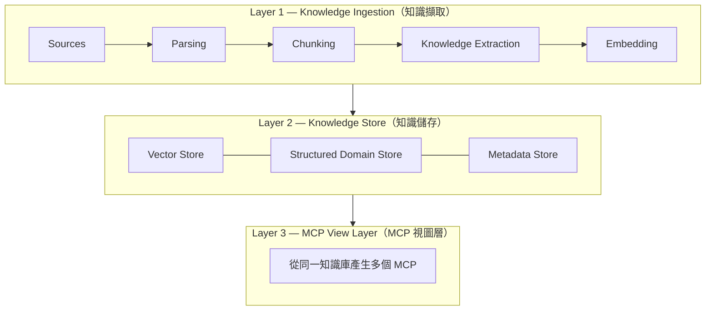

# OpenDomainMCP — 產品需求文件（PRD）

> 本文件彙整 OpenDomainMCP 自啟動至今的產品需求，整合 PRD v1（隱含於初版實作）與 **PRD v2**（現行版本），作為產品面的單一真實來源。技術實作細節見 [ARCHITECTURE.md](./ARCHITECTURE.md)，開發任務與進度見 [TASKS.md](./TASKS.md)。

---

## 1. Executive Summary（執行摘要）

OpenDomainMCP 是一個將**企業產品知識**轉換為 **MCP 可存取的領域智慧（domain intelligence）** 的平台，供 AI agent 使用。

平台會擷取文件、原始碼、API 規格、維運程序與支援知識，萃取出結構化的領域理解，並發布專用的 MCP 端點，讓 agent 在執行動作**之前**能先查詢。

**目標**：降低幻覺（hallucination）、提升維運準確度，並為 AI 驅動的工作流提供領域接地（domain grounding）。

---

## 2. Problem（問題）

AI agent 常因缺乏產品專屬理解而失敗，例如：

- 錯誤的設定步驟
- 無效的 API 用法
- 遺漏權限要求
- 不正確的故障排除程序
- 誤解業務術語

現行 RAG 方案聚焦於**文件檢索**，並未對**領域知識建模**。

---

## 3. Vision（願景）

讓每個軟體產品都能發布自己的領域感知 MCP。

AI agent 在採取行動前，應能詢問：

> 「我做這件事之前該知道什麼？（What should I know before doing this?）」

---

## 4. Product Principles（產品原則）

1. **Upload once** — 上傳一次
2. **Extract automatically** — 自動萃取
3. **Review visually** — 視覺化審核
4. **Publish MCPs** — 發布 MCP
5. **Ground agents before execution** — 執行前先接地

---

## 5. User Personas（使用者角色）

| 角色 | 需求 | 成功定義 |
|------|------|----------|
| **Product Manager** | 產品工作流知識、功能描述、限制 | Agent 理解產品行為 |
| **Solutions Architect** | 系統架構、相依性、整合 | Agent 能推理系統設計 |
| **Operations Team** | SOP、Runbook、故障排除 | Agent 正確執行維運程序 |
| **Engineering Team** | 程式碼理解、API 對應、元件擁有權 | Coding agent 理解實作細節 |

---

## 6. Scope（範圍）

### In Scope（範圍內）

| 類別 | 來源格式 | 實作狀態 |
|------|----------|----------|
| **Documentation** | PDF、Markdown、HTML、DOCX、Wiki exports | ✅ PDF/MD/HTML/DOCX 已支援；✅ MediaWiki XML 匯出（`ingest/wiki.py`）；Confluence HTML 以一般 HTML 擷取 |
| **Source Code** | Git repositories、Zip packages | ✅ 已支援（Phase 2 M4） |
| **API Specifications** | Swagger、OpenAPI、GraphQL | ✅ OpenAPI/Swagger 已支援；✅ GraphQL SDL 已支援（`ingest/graphql.py`） |
| **Support Knowledge** | FAQ、KB Articles、Troubleshooting Guides | ✅ 以一般文件擷取 + 知識類型分類支援 |
| **Operational Knowledge** | Runbooks、SOPs、Incident Response Guides | ✅ 以一般文件擷取 + 知識類型分類支援 |

> 註：GraphQL SDL 與 MediaWiki XML 匯出已實作；Confluence HTML 匯出目前以一般 HTML 文字擷取（未做逐頁切分），列為後續強化。

---

## 7. Architecture（架構分層）

平台採三層架構：

技術實作對應見 [ARCHITECTURE.md](./ARCHITECTURE.md)。

---

## 8. Knowledge Model（知識模型）

每個知識項目（knowledge item）包含下列屬性：

| 屬性 | 說明 | 實作欄位 | 狀態 |
|------|------|----------|------|
| Knowledge Type | 知識類型（見下） | `knowledge_type` | ✅ |
| Source Type | 來源類型（code/text/api） | `kind` | ✅ |
| Audience | 目標對象 | `audience` | ✅ |
| Confidence | 信心分數 0–1 | `confidence` | ✅ |
| Version | 版本 | `version` | ✅（欄位存在，LLM 暫不主動萃取） |
| Related Entities | 關聯實體 | `relations` / `concepts` | ✅ |
| Permissions | 權限 | `permissions` | ✅ |
| Tags | 標籤 | `tags` | ✅ |
| References | 外部參照（URL/票號） | `references` | ✅ |
| Review Status | 審核狀態 | `review_status` | ✅（Phase 2 新增） |

### Knowledge Types（知識類型，共 12 種）

`Feature`、`Workflow`、`API`、`Permission`、`Constraint`、`Error`、`Troubleshooting`、`Architecture`、`Code`、`Glossary`、`Runbook`、`FAQ`

### Audiences（對象，共 5 種）

`product_manager`、`solutions_architect`、`operations`、`engineering`、`support`

---

## 9. MCP Views（MCP 視圖）

同一知識庫可產生多個角色專屬 MCP，每個工具皆為「帶過濾的檢索」。**5 個視圖皆已實作（Phase 2 M2）**。

| View | Purpose | Tools |
|------|---------|-------|
| **Product MCP** | 產品使用理解 | `get_feature()`、`get_workflow()`、`get_constraint()`、`search_product_knowledge()` |
| **Operations MCP** | 執行指引 | `get_runbook()`、`get_troubleshooting()`、`get_incident_response()`、`get_rollback_procedure()` |
| **Developer MCP** | 程式碼理解 | `search_code()`、`get_class()`、`get_function()`、`trace_dependency()`、`get_api_implementation()` |
| **Support MCP** | 客戶支援 | `get_known_issue()`、`get_error_explanation()`、`get_resolution_steps()`、`search_faq()` |
| **Architecture MCP** | 系統理解 | `get_component()`、`get_dependency()`、`get_dataflow()`、`search_architecture()` |

工具→過濾條件對照見 [ARCHITECTURE.md](./ARCHITECTURE.md) §MCP Views。

---

## 10. Web Dashboard（網頁主控台）

| 模組 | 功能 | 對應頁面 | 狀態 |
|------|------|----------|------|
| **Workspace** | 管理產品、來源、索引 | Dashboard、Ingest、Settings | ✅ 基本版 |
| **知識庫管理** | 建立 / 切換 / 刪除知識庫（collection） | 側欄切換器（➕ 建立、🗑 刪除＋確認） | ✅（刪除 UI 於 2026-06-20 補上，PR #18） |
| **Knowledge Explorer** | 瀏覽/搜尋/篩選（依類型/來源/對象） | Explore、Browse | ✅ |
| **Knowledge Review** | 核准/編輯/拒絕擷取、手動新增 | Review | ✅（Phase 2 M5） |
| **MCP Builder** | 建立 MCP 視圖、設定檢索政策、指派權限、發布端點 | McpBuilder | ✅ 視圖/政策設定；✅ 動態發布 HTTP/SSE 端點（`/mcp/{view}` + `/api/mcp/endpoints`）；✅ 視圖層級 RBAC（API key→role→views） |
| **Graph Explorer** | 瀏覽實體/相依/工作流圖 | Graph | ✅（Phase 3） |
| **Pre-Execution Advisor** | 執行前彙整 Workflow/Risks/Permissions/Dependencies/Constraints | Advisor | ✅（Phase 4） |
| **Metrics** | Product / Agent 指標儀表板 | Metrics | ✅（Phase 4） |
| **Agent Simulator** | 輸入任務、模擬 MCP 呼叫、檢視脈絡、驗證接地品質 | Simulator | ✅（Phase 2 M5） |

---

## 11. Retrieval Engine（檢索引擎）

- **Hybrid Search**：Vector Search + Keyword Search（BM25）以 RRF 融合 ✅
- **Metadata Filtering**：依 `kind/language/symbol/knowledge_type/review_status` 過濾 ✅
- **Re-ranking**：選用 cross-encoder ✅
- **Policy Enforcement**：`retrieve_approved_only` 限定已核准知識 ✅；視圖層級 RBAC（API key→role→允許的 views，`ODM_AUTH_ENABLED`/`ODM_API_KEYS`）✅；多租戶隔離（`ODM_MULTI_TENANT` + `X-Tenant`，collection 命名空間）✅

---

## 12. Success Metrics（成功指標）

### Product Metrics

- Published MCPs（已發布 MCP 數）
- Knowledge Objects（知識物件數）
- Indexed Sources（已索引來源數）

### Agent Metrics

- Grounding Hit Rate（接地命中率）
- Task Success Rate（任務成功率）
- Retrieval Precision（檢索精確度）
- Hallucination Reduction（幻覺降低）

> 現況：除 Agent Simulator 的單次 grounding 統計外，已實作系統性指標蒐集（`metrics/` + `/api/metrics`，於 search/ask/simulate 記錄事件）與**指標儀表板**（Web `Metrics` 頁）：Product 指標（Published MCPs、Knowledge Objects、Indexed Sources）與 Agent 指標（Grounding Hit Rate、Retrieval Precision、avg hits/score）。詳見 [FEATURES.md](./FEATURES.md) §Metrics。

---

## 13. Roadmap（路線圖）

| Phase | 內容 | 狀態 |
|-------|------|------|
| **Phase 1** | Document + Code Ingestion、Vector Retrieval、Basic MCP | ✅ 已完成 |
| **Phase 2** | Knowledge Classification、Knowledge Review、Multiple MCP Views | ✅ 已完成 |
| **Phase 3** | Workflow Graph、Dependency Graph、Entity Graph | ✅ 已完成 |
| **Phase 4** | Agent Pre-Execution Advisor、Success Metrics | ✅ 已完成 |

### Phase 4 願景：Pre-Execution Advisor

Agent 詢問：「執行動作 X 之前需要哪些知識？」

系統在執行前回傳：**Workflow、Risks、Permissions、Dependencies、Constraints**。

---

_最後更新：2026-06-17_
