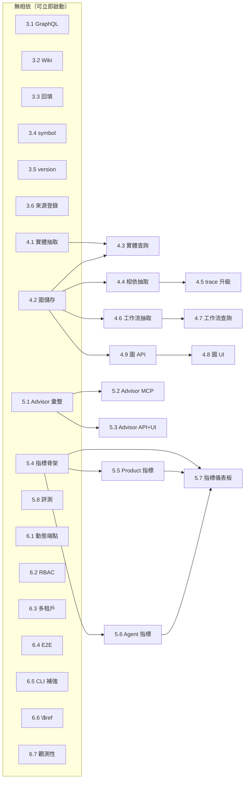

# OpenDomainMCP — 開發任務清單（Development Tasks）

> 本文件列出自專案起始至今的**所有**開發任務，含已完成與未完成。產品需求見 [PRD.md](./PRD.md)，技術細節見 [ARCHITECTURE.md](./ARCHITECTURE.md)。

## 圖例（Legend）

- **狀態**：✅ 已完成 ／ ⬜ 未完成 ／ 🔶 部分完成
- **Effort**：`[Low]` 約 0.5–1 天可完成的小型變更；`[Medium]` 約 1–3 天的中型變更。
- **拆割原則**：任何大於 Medium 的任務一律拆成多個 ≤Medium 子任務（見 Phase 3/4）。
- **位置**：大致修改的檔案/模組。

## 進度總覽

| 區塊 | 任務數 | 已完成 |
|------|--------|--------|
| Phase 0–1（基礎平台） | 18 | 18 ✅ |
| Phase 2（M1–M5 typed knowledge） | 22 | 22 ✅ |
| Phase 2 收尾缺口 | 6 | 6 ✅ |
| Phase 3（Graphs） | 9 | 9 ✅ |
| Phase 4（Pre-Execution Advisor + Metrics） | 8 | 8 ✅ |
| 工程品質與強化 | 7 | 7 ✅ |
| Phase 5（瀏覽器實測與前端修正） | 2 | 2 ✅ |

> **2026-06-19 衝刺：PRD 全功能完成。** 所有先前 ⬜ 任務（3.2/3.3/3.6、4.4/4.5/4.8、
> 5.1/5.2/5.3/5.5/5.6/5.7、6.1/6.2/6.3/6.4/6.5/6.7）已於本輪以三個並行 wave 完成並併入，
> 全套件 **268 passed, 3 skipped**（後端）＋ 前端 `tsc` 綠燈、`vite build` 成功、Playwright E2E **7 passed**。
> 詳細過程見 [DEVLOG.md](./DEVLOG.md)，功能說明見 [FEATURES.md](./FEATURES.md)。
>
> **2026-06-20：瀏覽器全功能實測。** 以 Playwright（Chrome）逐一實測 12 個 Web 頁面與互動流程，
> 並把整個專案 `src/opendomainmcp`（42 檔 / 296 chunks）擷取進 `project_self` 知識庫，
> 端到端驗證 chunk→extract→embed→store 流程。修正 2 項前端缺陷（PR #18 已併入 main，見 Phase 5）。

---

## ✅ Phase 0–1：基礎平台（已完成）

對應 PRD Roadmap Phase 1（Document + Code Ingestion、Vector Retrieval、Basic MCP）。

| # | 狀態 | Effort | 任務 | 內容 | 位置 |
|---|------|--------|------|------|------|
| 1.1 | ✅ | Medium | 專案骨架與設定 | 套件結構、`Settings`（env/.env/JSON override）、資料模型 | `pyproject.toml`、`config.py`、`models.py` |
| 1.2 | ✅ | Medium | 可插拔 embedder | local（fastembed）/ openai / voyage 工廠 | `embedding/{base,local,cloud}.py` |
| 1.3 | ✅ | Medium | 向量儲存 | Chroma PersistentClient、upsert/search、CRUD、collections | `store/chroma_store.py` |
| 1.4 | ✅ | Low | 文件載入與型別偵測 | pdf/docx/html/markdown/text + fail-loud | `ingest/loader.py` |
| 1.5 | ✅ | Low | 遞迴文字切分 | chunk_size/overlap、無外部相依 | `ingest/text_splitter.py` |
| 1.6 | ✅ | Medium | AST 程式碼切分 | tree-sitter（11 種具 AST wheel；其餘辨識為程式碼者退回 line 切分）、symbol 抽取 | `ingest/code_splitter.py` |
| 1.7 | ✅ | Medium | 擷取 pipeline | load→split→extract→embed→store 編排、concurrency、progress callback | `ingest/pipeline.py` |
| 1.8 | ✅ | Medium | LLM 知識萃取 | Claude 產生 summary/concepts/relations、NullExtractor | `extract/knowledge.py` |
| 1.9 | ✅ | Low | 共享 Context | `build_context()` 單一接線點 | `context.py` |
| 1.10 | ✅ | Medium | CLI | ingest/search/ask/stats/clear/collections | `cli.py` |
| 1.11 | ✅ | Medium | 單一 MCP server | ingest_path/search_knowledge/ask/get_stats/list_collections | `server.py` |
| 1.12 | ✅ | Medium | FastAPI 後端 | stats/search/ask(SSE)/upload/ingest(SSE)/items CRUD/settings/collections | `api/app.py` |
| 1.13 | ✅ | Medium | React 主控台 | Dashboard/Ingest/Explore/Ask/Browse/Settings + 設計系統/暗色 | `web/src/**` |
| 1.14 | ✅ | Medium | 混合檢索 | dense + BM25 + RRF 融合、metadata 過濾 | `store/chroma_store.py`、`retrieval/lexical.py` |
| 1.15 | ✅ | Low | Cross-encoder re-rank | 選用 reranker，統一分數 | `retrieval/rerank.py` |
| 1.16 | ✅ | Medium | 引用問答（ask） | 編號 sources、Claude 合成、SSE token 串流 | `query/rag.py` |
| 1.17 | ✅ | Medium | 多知識庫 + 增量同步 | Chroma collections、prune 過期/刪除檔 | `store/`、`pipeline.py` |
| 1.18 | ✅ | Medium | 安全與韌性 | ingest_root 限制、symlink-safe、上傳上限、timeout/retry | `pipeline.py`、`api/app.py`、`store/` |

---

## ✅ Phase 2：Typed Knowledge Management（已完成，PR #6 併入 main）

對應 PRD Roadmap Phase 2（Knowledge Classification、Knowledge Review、Multiple MCP Views）。

### M1 — 知識類型分類（commit 8327bff）

| # | 狀態 | Effort | 任務 | 內容 | 位置 |
|---|------|--------|------|------|------|
| 2.1 | ✅ | Low | 擴充 KnowledgeUnit | 新增 knowledge_type/audience/confidence/version/permissions/tags/references/review_status，全帶預設 | `models.py` |
| 2.2 | ✅ | Low | 知識類型/對象常數 | `KNOWLEDGE_TYPES`(12)、`AUDIENCES`(5) | `models.py` |
| 2.3 | ✅ | Low | metadata 扁平化 | list → join 字串、丟空值、Chroma 友善 | `models.py` `Chunk.metadata()` |
| 2.4 | ✅ | Medium | 擴充萃取 prompt + 解析 | `_SYSTEM` 列舉白名單、`_parse` 正規化（clamp/whitelist） | `extract/knowledge.py` |
| 2.5 | ✅ | Low | 過濾欄位擴充 | `build_where` 加 knowledge_type/review_status | `store/chroma_store.py` |
| 2.6 | ✅ | Low | FakeExtractor 延伸 | 測試回傳新分類欄位 | `tests/conftest.py` |

### M2 — 多 MCP Views（commit b56aad4）

| # | 狀態 | Effort | 任務 | 內容 | 位置 |
|---|------|--------|------|------|------|
| 2.7 | ✅ | Medium | 宣告式 view 定義 | `ViewTool`/`ViewSpec` + `VIEWS`（5 視圖 22 工具） | `views/__init__.py` |
| 2.8 | ✅ | Medium | 視圖 server 工廠 | `build_view_server`/`get_server`、`--view`/`ODM_MCP_VIEW` | `server.py` |
| 2.9 | ✅ | Low | view 檢索執行器 | `run_view_tool`：audience 後過濾、approved-only 注入 | `views/__init__.py` |
| 2.10 | ✅ | Low | 視圖入口點 | `opendomainmcp-view` console script | `pyproject.toml` |

### M3 — Knowledge Review 工作流（commit c3f0d9a）

| # | 狀態 | Effort | 任務 | 內容 | 位置 |
|---|------|--------|------|------|------|
| 2.11 | ✅ | Low | review_mode 設定 | 新擷取標 pending | `config.py`、`pipeline.py` |
| 2.12 | ✅ | Low | 核准/拒絕端點 | `POST /api/items/{id}/approve`、`/reject` | `api/app.py` |
| 2.13 | ✅ | Low | 手動新增知識 | `POST /api/items`（`ItemCreate`，自動 approved） | `api/app.py` |
| 2.14 | ✅ | Low | review_status 過濾 | `/api/items` 與 search 支援篩選 | `api/app.py`、`store/` |
| 2.15 | ✅ | Low | approved-only 政策 | `retrieve_approved_only` 設定 | `config.py`、`views/`、`api/app.py` |

### M4 — 新增擷取來源（commit 6f7566c）

| # | 狀態 | Effort | 任務 | 內容 | 位置 |
|---|------|--------|------|------|------|
| 2.16 | ✅ | Medium | Git/Zip 來源 | `is_git_spec`/`is_zip_spec`/`prepared_source`、shallow clone、zip-slip 防護 | `ingest/sources.py`、`pipeline.py` |
| 2.17 | ✅ | Medium | OpenAPI/Swagger 解析 | 每 operation 一 chunk、預分類 API、JSON/YAML | `ingest/openapi.py`、`loader.py` |
| 2.18 | ✅ | Low | pipeline 分流 | `kind="api"` 走 OpenAPI splitter、預分類跳過 LLM | `pipeline.py` |

### M5 — Web UI（commit 40a8aba）

| # | 狀態 | Effort | 任務 | 內容 | 位置 |
|---|------|--------|------|------|------|
| 2.19 | ✅ | Medium | Review 頁 | 佇列 tabs、核准/拒絕/編輯、手動新增 Modal | `web/src/pages/Review.tsx` |
| 2.20 | ✅ | Medium | MCP Builder 頁 | 列視圖、政策設定、發布指令片段 | `web/src/pages/McpBuilder.tsx`、`api/app.py` `/api/views` |
| 2.21 | ✅ | Medium | Agent Simulator 頁 | 任務輸入、跑視圖、grounding 統計 | `web/src/pages/Simulator.tsx`、`api/app.py` `/api/simulate` |
| 2.22 | ✅ | Low | 前端整合 | api.ts 方法/型別、路由、導覽、icons | `web/src/{api.ts,main.tsx,App.tsx,components/icons.tsx}` |

---

## ✅ Phase 2 收尾缺口（已完成）

PRD 範圍內但 Phase 2 尚未補齊的項目。

| # | 狀態 | Effort | 任務 | 內容 | 位置 |
|---|------|--------|------|------|------|
| 3.1 | ✅ | Medium | GraphQL schema 擷取 | 解析 `.graphql`/SDL，每 type/query/mutation 一 chunk、預分類 API | 新增 `ingest/graphql.py`、`loader.py` |
| 3.2 | ✅ | Low | Wiki export 擷取 | 支援 Confluence/MediaWiki 匯出（XML/HTML bundle） | `ingest/loader.py`、可能新增 `ingest/wiki.py` |
| 3.3 | ✅ | Low | 舊資料 review 回填 | CLI `backfill-review --status approved`，替既有 chunk 補 review_status | `cli.py`、`store/` |
| 3.4 | ✅ | Medium | Developer 視圖 symbol 精準化 | `get_class/get_function` 改用 symbol/node_type 精準查詢而非僅 kind=code | `views/__init__.py`、`store/build_where` |
| 3.5 | ✅ | Low | Version 欄位萃取 | prompt 與 `_parse` 補 `version`（目前欄位存在但未萃取） | `extract/knowledge.py` |
| 3.6 | ✅ | Low | Workspace 來源登錄 | UI 記錄/管理已擷取來源清單（產品/來源/索引狀態） | `web/src/pages/Dashboard.tsx`、`api/app.py` |

---

## ✅ Phase 3：知識圖譜（已完成）

對應 PRD Roadmap Phase 3。整體規模大於 Medium，已拆成 ≤Medium 子任務。

### 3A — Entity Graph（實體圖）

| # | 狀態 | Effort | 任務 | 內容 | 位置 |
|---|------|--------|------|------|------|
| 4.1 | ✅ | Medium | 實體抽取與正規化 | LLM 單次呼叫疊加有型別 entities/typed_relations；正規化/去重/別名合併（PR #12） | `extract/knowledge.py`、`graph/normalize.py`、`graph/builder.py` |
| 4.2 | ✅ | Medium | 圖儲存層 | 持久化 nodes/edges 於 **MariaDB**（PyMySQL，非 SQLite）；與 chunk 關聯、依 collection 隔離、隨向量增量同步（PR #12） | `graph/store.py`、`context.py`、`pipeline.py` |
| 4.3 | ✅ | Low | 實體查詢 API/MCP | `get_entity`、`list_related_entities`（depth≤2）+ `/api/graph/*`（PR #12） | `api/app.py`、`server.py`、`views/__init__.py` |

### 3B — Dependency Graph（相依圖）

| # | 狀態 | Effort | 任務 | 內容 | 位置 |
|---|------|--------|------|------|------|
| 4.4 | ✅ | Medium | 程式碼相依抽取 | 由 AST import/call 建立 module/function 相依邊 | `ingest/code_splitter.py`、`graph/deps.py` |
| 4.5 | ✅ | Low | trace_dependency 升級 | Developer 視圖工具改走相依圖實作 | `views/__init__.py`、`graph/` |

### 3C — Workflow Graph（工作流圖）

| # | 狀態 | Effort | 任務 | 內容 | 位置 |
|---|------|--------|------|------|------|
| 4.6 | ✅ | Medium | 工作流步驟抽取 | 由 Workflow/Runbook 類型知識抽取有序步驟與前後關係 | 新增 `graph/workflow.py`、`extract/` |
| 4.7 | ✅ | Low | 工作流查詢 | `get_workflow_steps`、前置條件查詢 | `api/app.py`、`server.py` |

### 3D — 圖視覺化

| # | 狀態 | Effort | 任務 | 內容 | 位置 |
|---|------|--------|------|------|------|
| 4.8 | ✅ | Medium | 圖瀏覽 UI | 前端以圖元件呈現 entity/dependency/workflow | 新增 `web/src/pages/Graph.tsx` |
| 4.9 | ✅ | Low | 圖 API 端點 | `/api/graph/{type}` 回傳 nodes/edges | `api/app.py` |

---

## ✅ Phase 4：Pre-Execution Advisor + 指標（已完成）

對應 PRD Roadmap Phase 4 與 Success Metrics。整體規模大於 Medium，已拆解。

### 4A — Pre-Execution Advisor

| # | 狀態 | Effort | 任務 | 內容 | 位置 |
|---|------|--------|------|------|------|
| 5.1 | ✅ | Medium | Advisor 彙整器 | 給定動作 X，彙整 Workflow/Risks/Permissions/Dependencies/Constraints | 新增 `advisor/` |
| 5.2 | ✅ | Low | Advisor MCP 工具 | `what_should_i_know_before(action)` 跨視圖彙整 | `server.py`、`views/` |
| 5.3 | ✅ | Low | Advisor API + UI | 端點與前端呈現風險/權限/相依清單 | `api/app.py`、`web/src/pages/` |

### 4B — Success Metrics 蒐集

| # | 狀態 | Effort | 任務 | 內容 | 位置 |
|---|------|--------|------|------|------|
| 5.4 | ✅ | Medium | 指標蒐集骨架 | 記錄檢索/問答事件（query、hits、scores、命中類型） | 新增 `metrics/` |
| 5.5 | ✅ | Low | Product 指標 | Published MCPs、Knowledge Objects、Indexed Sources 計數 | `metrics/`、`api/app.py` |
| 5.6 | ✅ | Low | Agent 指標 | Grounding Hit Rate、Retrieval Precision（延伸 Simulator 統計） | `metrics/`、`api/simulate` |
| 5.7 | ✅ | Medium | 指標儀表板 | 前端指標頁 | 新增 `web/src/pages/Metrics.tsx` |
| 5.8 | ✅ | Medium | 幻覺降低評測 | 建立離線評測集與 grounding 對照基準 | 新增 `evals/` |

---

## ✅ 工程品質與強化（已完成）

跨階段的非功能性改進。

| # | 狀態 | Effort | 任務 | 內容 | 位置 |
|---|------|--------|------|------|------|
| 6.1 | ✅ | Medium | 動態 MCP 端點發布 | MCP Builder 真正 spawn/管理 HTTP transport 端點（目前僅顯示啟動指令） | `server.py`、`api/app.py`、`McpBuilder.tsx` |
| 6.2 | ✅ | Medium | 權限/角色（RBAC） | MCP 視圖層級的存取控制與 API 金鑰 | `api/app.py`、`config.py` |
| 6.3 | ✅ | Medium | 多租戶隔離 | workspace/tenant 邊界與資料隔離 | `context.py`、`store/` |
| 6.4 | ✅ | Low | E2E 前端測試 | Review/Builder/Simulator 的端到端測試（Playwright） | 新增 `web/tests/` |
| 6.5 | ✅ | Low | CLI 擷取 Git/Zip 文件補強 | CLI `ingest` 說明與 help 補上新來源用法 | `cli.py`、`docs/` |
| 6.6 | ✅ | Low | OpenAPI 巢狀 $ref 解析 | 解析 `$ref` 以豐富 operation 文字 | `ingest/openapi.py` |
| 6.7 | ✅ | Low | 觀測性/日誌 | 結構化日誌與基本 metrics endpoint（`/api/health` 擴充） | `api/app.py` |

---

## ✅ Phase 5：瀏覽器實測與前端修正（已完成，2026-06-20）

以 Playwright（使用者本機 Chrome）對 Web Dashboard 做全功能實測，並以「自我擷取」（把本專案原始碼擷取進 `project_self` 知識庫）端到端驗證擷取流程。實測中發現並修正兩項前端缺陷。詳見 [DEVLOG.md](./DEVLOG.md) 2026-06-20 章節。

| # | 狀態 | Effort | 任務 | 內容 | 位置 |
|---|------|--------|------|------|------|
| 7.1 | ✅ | Low | Modal portal 修正 | 「New knowledge base」對話框被側欄 `position: sticky` 的 stacking context 困住，主內容蓋住對話框 → 改用 React `createPortal` 掛到 `document.body`，修正所有 Modal | `web/src/components/ui.tsx` |
| 7.2 | ✅ | Low | 刪除知識庫 UI | `api.deleteCollection` 與後端 `DELETE /api/collections/{name}` 已存在但 UI 從未呼叫 → 側欄加 🗑 按鈕 + 確認框；僅剩一個知識庫時停用、刪除後自動切換並重載 | `web/src/App.tsx` |

> **驗證**：12 頁全綠、互動流程（Explore/Ask/Advisor/Simulator/Graph/Metrics/Settings）全通過；自我擷取 `src/opendomainmcp` → 42 檔 / 296 chunks（dim 1024），search/ask 對自身程式碼可正確接地（grounding 92.3%）。兩項修正以 **PR #18** 併入 main（merge commit `22b7137`）。同時更正前一輪一項誤判：應用為 **HashRouter**，deep-link/F5 不會 404。

---

## ✅ Phase 6：知識合成與文章系統（已完成，2026-06-20～21）

把零散 chunk 升華為跨 chunk、具商業意義的**文章（Article）**，並讓文章參與檢索與瀏覽。設計與計畫見 `docs/superpowers/specs/2026-06-20-knowledge-synthesis-articles-design.md`、`docs/superpowers/plans/2026-06-20-article-augmented-retrieval.md`、`docs/superpowers/specs/2026-06-21-articles-browse-page-design.md`。功能說明見 [FEATURES.md](./FEATURES.md) §19–20、架構見 [ARCHITECTURE.md](./ARCHITECTURE.md) §24。

| # | 狀態 | Effort | 任務 | 內容 | 位置 |
|---|------|--------|------|------|------|
| 6.1 | ✅ | High | 知識合成編排器 | 主題探勘（結構閘門：cross-validated／business-hits）→ 證據檢索 → `ArticleWriter` 撰寫 → `ArticleCritic` 評審閘門（grounded + business_meaningful 才留）→ 存入 `{collection}__articles`；`Article.id` 內容雜湊 → 冪等 | `synthesis/`、`models.py`（PR #20） |
| 6.2 | ✅ | Med | 文章增強檢索 | `search_unified` 以 RRF 融合 chunk + 文章；`retrieve_include_articles` 旗標控制；`/api/search`、`/api/ask` 接線 | `retrieval/unified.py`、`config.py`（PR #21） |
| 6.3 | ✅ | Med | Articles 瀏覽頁 | 唯讀瀏覽：依 business_relevance 排序 + 搜尋過濾 + 詳情；`GET /api/articles` | `web/src/pages/Articles.tsx`、`api/app.py`（PR #22，含 Playwright smoke `cf77d8a`） |
| 6.4 | ✅ | Low | 隱藏內部 sibling collection | collection 列表過濾掉 `__articles` 內部 collection，避免使用者誤選 | `store/`（PR #23，`b924b29`） |
| 6.5 | ✅ | Low | Dashboard pipeline 真實資料 | 首頁 Pipeline 卡片改以 `/api/stats`+`/api/sources`+`/api/settings` 的真實值呈現各階段（原為寫死字串） | `web/src/pages/Dashboard.tsx`（PR #24） |

> **CLI**：`opendomainmcp synthesize [--limit N] [--dry-run]`（按需執行，非擷取階段、無自動排程）。**測試**：`test_synthesis_topics`／`test_synthesis_article_model`／`test_synthesis_articles`／`test_synthesis_llm`／`test_retrieval_unified` 全離線覆蓋。

---

## 相依性分析（Dependency Analysis）

> 針對所有 ⬜ 未完成任務（30 項），分析彼此的前置相依，標出**可立即啟動**（無未完成前置）與**須等待**的任務，作為並行開發排程依據。
>
> 「前置」僅計入**尚未完成**的任務；所有任務皆已建立在 Phase 0–2 的完成基礎之上（embedder / store / pipeline / views / sources / api / web），故不重複列出。

### 相依表

| # | 任務 | 前置相依（未完成） | 可立即啟動 | 主要檔案（並行衝突面） |
|---|------|--------------------|:---------:|------------------------|
| 3.1 | GraphQL schema 擷取 | — | ✅ | `ingest/graphql.py`(新)、`loader.py` |
| 3.2 | Wiki export 擷取 | — | ✅ | `ingest/wiki.py`(新)、`loader.py` |
| 3.3 | 舊資料 review 回填 | — | ✅ | `cli.py`、`store/` |
| 3.4 | Developer 視圖 symbol 精準化 | — | ✅ | `views/__init__.py`、`store/build_where` |
| 3.5 | Version 欄位萃取 | — | ✅ | `extract/knowledge.py` |
| 3.6 | Workspace 來源登錄 | — | ✅ | `web/Dashboard.tsx`、`api/app.py` |
| 4.1 | 實體抽取與正規化 | — | ✅ | `graph/entities.py`(新) |
| 4.2 | 圖儲存層 | — | ✅ | `graph/store.py`(新) |
| 4.3 | 實體查詢 API/MCP | 4.1, 4.2 | ⬜ | `api/app.py`、`server.py` |
| 4.4 | 程式碼相依抽取 | 4.2 | ⬜ | `graph/deps.py`(新)、`code_splitter.py` |
| 4.5 | trace_dependency 升級 | 4.4 | ✅ | `views/__init__.py`、`graph/` |
| 4.6 | 工作流步驟抽取 | 4.2 | ⬜ | `graph/workflow.py`(新)、`extract/` |
| 4.7 | 工作流查詢 | 4.6 | ✅ | `api/app.py`、`server.py` |
| 4.8 | 圖瀏覽 UI | 4.9 | ✅ | `web/pages/Graph.tsx`(新) |
| 4.9 | 圖 API 端點 | 4.2（資料來源 4.1/4.4/4.6） | ⬜ | `api/app.py` |
| 5.1 | Advisor 彙整器 | —（Phase 3 可豐富，非硬相依） | ✅ | `advisor/`(新) |
| 5.2 | Advisor MCP 工具 | 5.1 | ✅ | `server.py`、`views/` |
| 5.3 | Advisor API + UI | 5.1 | ✅ | `api/app.py`、`web/pages/` |
| 5.4 | 指標蒐集骨架 | — | ✅ | `metrics/`(新) |
| 5.5 | Product 指標 | 5.4 | ⬜ | `metrics/`、`api/app.py` |
| 5.6 | Agent 指標 | 5.4 | ⬜ | `metrics/`、`api/simulate` |
| 5.7 | 指標儀表板 | 5.4, 5.5, 5.6 | ⬜ | `web/pages/Metrics.tsx`(新) |
| 5.8 | 幻覺降低評測 | — | ✅ | `evals/`(新) |
| 6.1 | 動態 MCP 端點發布 | — | ✅ | `server.py`、`api/app.py`、`McpBuilder.tsx` |
| 6.2 | 權限/角色（RBAC） | — | ✅ | `api/app.py`、`config.py` |
| 6.3 | 多租戶隔離 | — | ✅ | `context.py`、`store/` |
| 6.4 | E2E 前端測試 | — | ✅ | `web/tests/`(新) |
| 6.5 | CLI Git/Zip 文件補強 | — | ✅ | `cli.py`、`docs/` |
| 6.6 | OpenAPI 巢狀 $ref 解析 | — | ✅ | `ingest/openapi.py` |
| 6.7 | 觀測性/日誌 | — | ✅ | `api/app.py` |

### 相依圖

### 結論

- **無相依、可立即啟動：18 項** — 3.1–3.6、4.1、4.2、5.1、5.4、5.8、6.1–6.7。
- **須等待前置：12 項** — 4.3、4.4、4.5、4.6、4.7、4.8、4.9、5.2、5.3、5.5、5.6、5.7。

### 並行開發排程（避免檔案衝突）

無相依的 18 項雖皆可獨立啟動，但部分**共用同一檔案**（如 `api/app.py`、`loader.py`、`views/__init__.py`、`store/`），同時改動會造成合併衝突。因此以「**每個共用檔案僅由一個任務持有**」為原則切成數個 wave，wave 內各任務檔案不重疊、可安全並行（每個 subagent 在獨立 git worktree 開發）。

**Wave 1（檔案互斥，已並行完成 ✅）：** 6 個 subagent 各於獨立 git worktree 開發、各自跑過完整測試後合併回本分支；合併後全套件 **133 passed**（基線 106 + 新增 27 個測試），零回歸。

| # | 任務 | 持有檔案 | 狀態 |
|---|------|----------|------|
| 3.1 | GraphQL 擷取 | `loader.py`、`pipeline.py`、`ingest/graphql.py`(新) | ✅ |
| 3.4 | Developer 視圖 symbol | `views/__init__.py`、`store/chroma_store.py` | ✅ |
| 3.5 | Version 欄位萃取 | `extract/knowledge.py`、`conftest.py` | ✅ |
| 5.4 | 指標蒐集骨架 | `metrics/`(新) | ✅ |
| 5.8 | 幻覺降低評測 | `evals/`(新) | ✅ |
| 6.6 | OpenAPI $ref 解析 | `ingest/openapi.py` | ✅ |

> 註：6.4（E2E 前端測試，Playwright）原列入 Wave 1，但此環境無瀏覽器/未建置前端無法驗證綠燈，移至後續 wave。

**後續 wave（持有 `api/app.py` 等熱點檔，需序列化或分批）：** 3.2（`loader.py`，與 3.1 互斥）、3.3、3.6、4.1、4.2、5.1、6.1、6.2、6.3、6.5、6.7。

---

## 附錄：里程碑與 Git 提交對照

| 里程碑 | Commit | 訊息 |
|--------|--------|------|
| M1 | `8327bff` | Classify extracted knowledge into typed domain fields |
| M2 | `b56aad4` | Role-specific MCP views over the shared store |
| M3 | `c3f0d9a` | Knowledge review workflow (approve / reject / manual add) |
| M4 | `6f7566c` | Ingest Git repos, Zip archives, and OpenAPI specs |
| M5 | `40a8aba` | Web UI for review, MCP builder, and agent simulator |
| Docs | `ee03100` | Document review-mode and approved-only settings in .env.example |
| Merge | `0f41cd4` | Merge PR #6 into main |

---

_最後更新：2026-06-21（新增 Phase 6 知識合成與文章系統，PR #20–24 併入 main）_

> **Phase 3 進展備註（2026-06-19）：** 子專案①（Entity Graph 基礎，4.1/4.2/4.3）已完成併入 main。設計與計畫見 `docs/superpowers/specs/2026-06-19-entity-graph-foundation-design.md` 與 `docs/superpowers/plans/2026-06-19-entity-graph-foundation.md`。
> - 4.2 圖儲存採 **MariaDB**（全平台必需依賴），向量仍在 Chroma；圖依 collection 隔離。
> - 4.2 完成後解鎖 4.4（程式碼相依抽取）、4.6（工作流步驟抽取）、4.9（圖 API）。
> - 已知延後項（記於 review）：圖寫入目前逐 chunk（每檔可批次化 + 連線重用），留待子專案②；`graph rebuild` 回填 CLI 暫緩（既有索引需重新擷取才有圖）。
